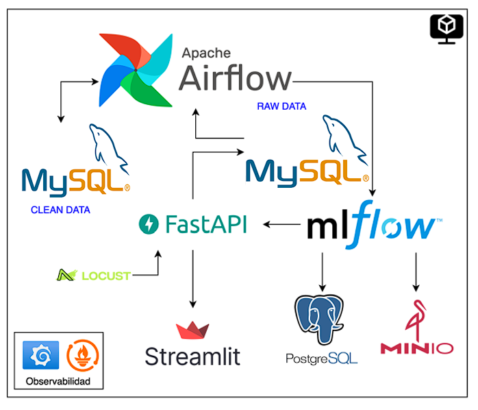
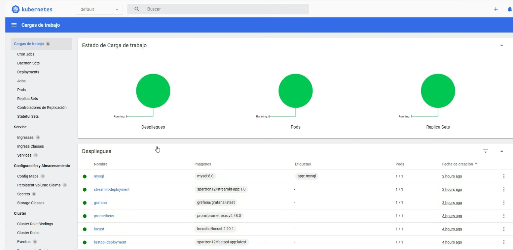
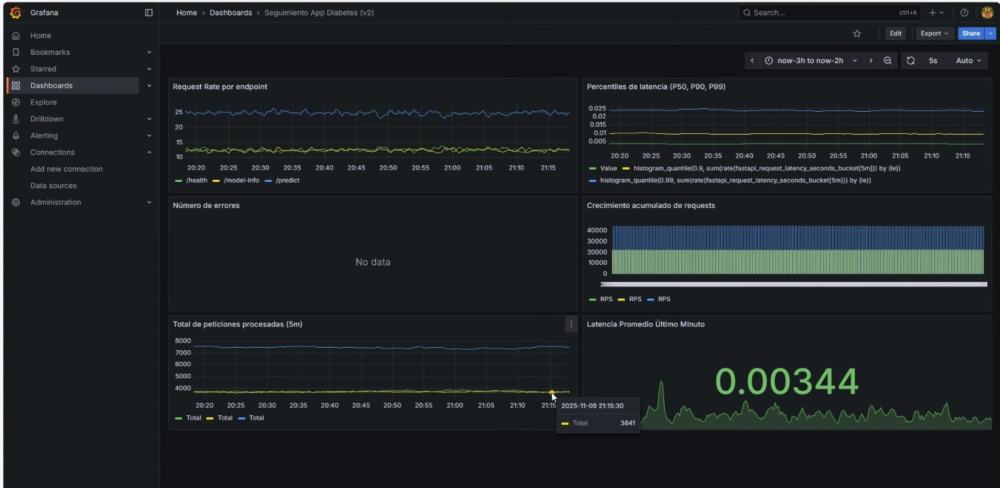
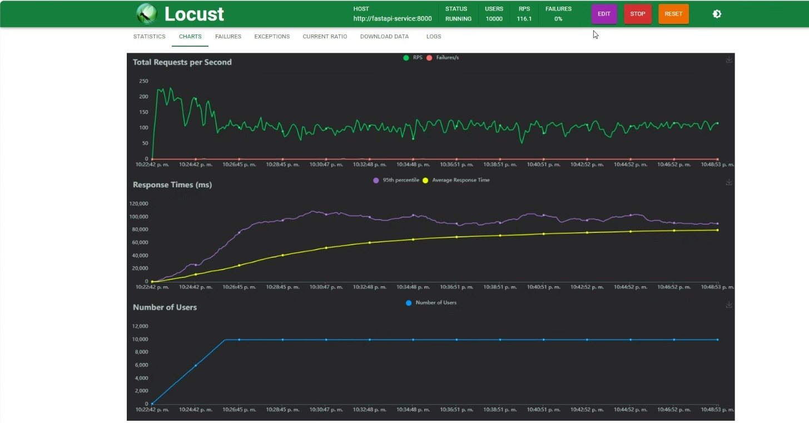
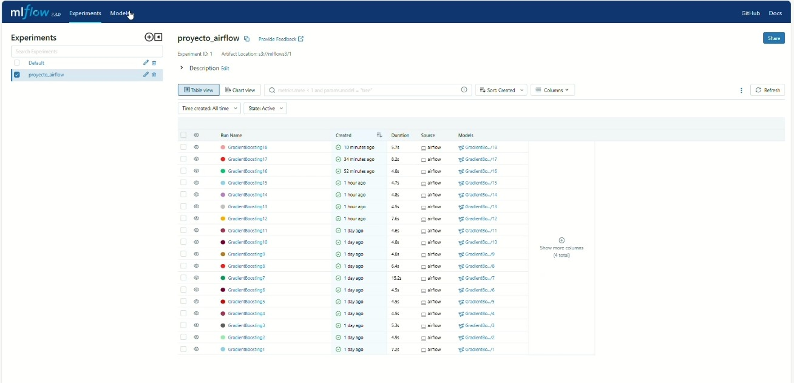
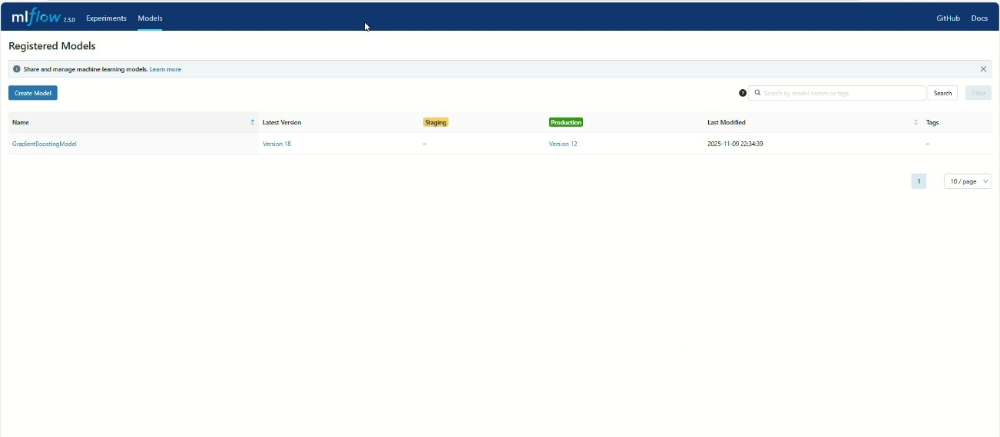
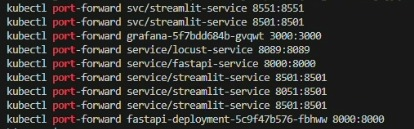
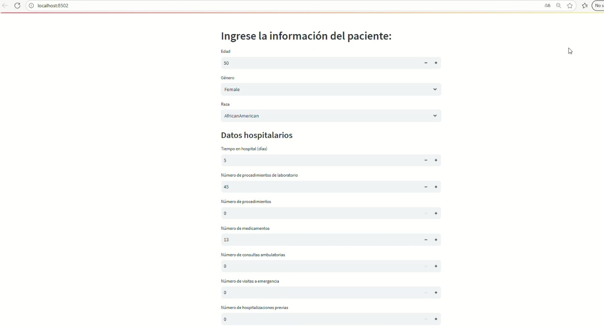
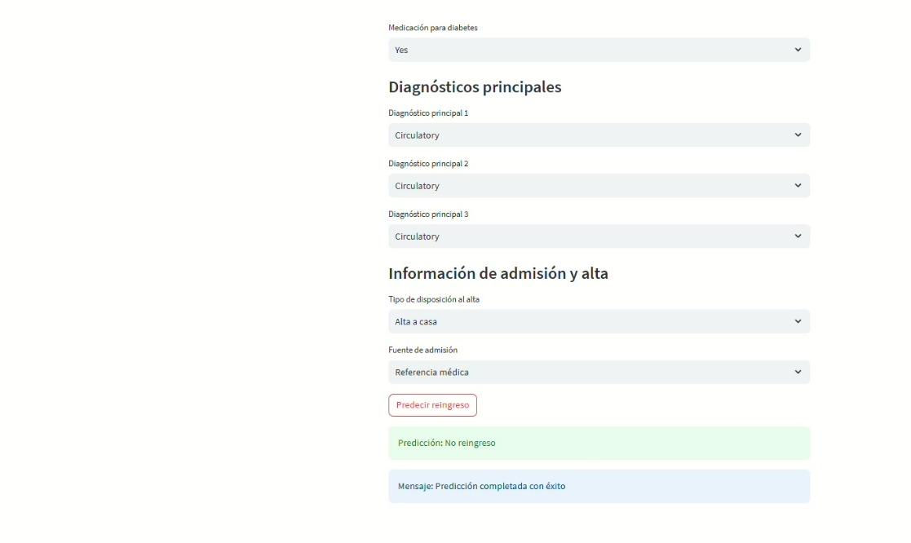

# MLOps Proyecto 3 

**Grupo:** Sebastián Rodríguez y David Córdova  
**Curso:** Machine Learning Operations (MLOps)  
**Profesor:** Cristian Javier Diaz Alvarez  
**Institución:** Pontificia Universidad Javeriana  
**Fecha:** Noviembre 2025

---

##  Descripción del Proyecto

Este proyecto implementa un **sistema completo de MLOps desplegado en Kubernetes** que automatiza todo el ciclo de vida del Machine Learning: desde la recolección y procesamiento de datos hasta el entrenamiento de modelos, despliegue en producción y monitoreo continuo.


### Objetivos Principales

 **Orquestación con Apache Airflow**: Creación de DAGs para la recolección, procesamiento y almacenamiento de datos de manera automatizada.  

 **Registro de experimentos con MLflow**: Seguimiento de modelos y artefactos con un backend SQL (MySQL) para metadatos y almacenamiento de artefactos en un bucket S3.  

 **API de Inferencia con FastAPI**: Creación de una API para consumir el modelo de mejor desempeño desde MLflow y exponerla para inferencias.  

 **Interfaz de usuario con Streamlit**: Desarrollo de una interfaz gráfica interactiva para permitir a los usuarios realizar predicciones de forma sencilla e intuitiva.  

 **Observabilidad con Prometheus y Grafana**: Monitoreo de métricas del sistema y creación de dashboards visuales para observar el rendimiento y uso de la infraestructura.  

 **Pruebas de carga con Locust**: Evaluación de la capacidad máxima de usuarios concurrentes para asegurar que la infraestructura soporte una alta carga de trabajo.  

 **Infraestructura AWS**: Despliegue de la API de datos en EC2, con encendido y apagado automático para optimizar el uso de recursos en función de la demanda.  

 **Despliegue en Kubernetes**: Orquestación de los servicios principales (FastAPI, Streamlit, Prometheus, Grafana) en contenedores dentro de un clúster de Kubernetes, mientras que Airflow y MLflow corren fuera de Kubernetes pero se integran con el resto de los servicios.

##  Dataset: Diabetes 130-US Hospitals (1999-2008)

### Descripción

El conjunto de datos representa **10 años de atención clínica en 130 hospitales de EE.UU.** Incluye más de **50 características** que representan los resultados del paciente y del hospital.

**Criterios de inclusión:**
- Encuentro de paciente hospitalizado (ingreso al hospital)
- Encuentro diabético con diagnóstico de cualquier tipo de diabetes
- Duración de estadia: mínimo 1 día, máximo 14 días
- Pruebas de laboratorio realizadas durante el encuentro
- Medicamentos administrados durante el encuentro

**Características incluyen:**
- Número de paciente, raza, sexo, edad
- Tipo de ingreso, tiempo en el hospital
- Especialidad médica del médico admitente
- Número de pruebas de laboratorio realizadas
- Resultado de la prueba de HbA1c
- Diagnóstico, número de medicamentos
- Medicamentos para la diabetes
- Visitas ambulatorias, hospitalizaciones y emergencias del año anterior

**Fuente:** [Diabetes 130-US hospitals for years 1999-2008](https://archive.ics.uci.edu/ml/datasets/Diabetes+130-US+hospitals+for+years+1999-2008)

---

##  Arquitectura del Sistema



### Diagrama de Flujo Completo

```
┌────────────────────────────────────────────────────────────────────────────┐
│                           AWS INFRASTRUCTURE                               │
├────────────────────────────────────────────────────────────────────────────┤
│                                                                            │
│  ┌──────────────┐    9:00 AM    ┌────────────────────────────────┐         │
│  │ EventBridge  │──────────────>│  StartEC2Instance (Lambda)     │         │
│  │   Schedule   │               │  Python 3.11                   │         │
│  └──────────────┘               └───────────────┬────────────────┘         │
│                                                  │                         │
│                                                  ▼                         │
│  ┌─────────────────────────────────────────────────────────────────┐       │
│  │              EC2 Instance (mlops_api)                           │       │
│  │              Instance ID: i-0b1fe2e74b0578256                   │       │
│  │              Type: t3.micro | OS: Ubuntu                        │       │
│  │  ┌───────────────────────────────────────────────────────────┐  │       │
│  │  │   Docker Container - Diabetes API (Flask)                 │  │       │
│  │  │   • Port: 5001                                            │  │       │
│  │  │   • Endpoint: /get_data                                   │  │       │
│  │  │   • Batch size: 15,000 registros                          │  │       │
│  │  │   • Update interval: 5 minutos                            │  │       │
│  │  │   • Auto-restart: enabled                                 │  │       │
│  │  └───────────────────────────────────────────────────────────┘  │       │
│  └─────────────────────────────────────────────────────────────────┘       │
│                                  │                                         │
│                                  │ 11:55 PM                                │
│                                  ▼                                         │
│  ┌──────────────┐          ┌────────────────────────────────┐              │
│  │ EventBridge  │─────────>│  StopEC2Instance (Lambda)      │              │
│  │   Schedule   │          │  Python 3.11                   │              │
│  └──────────────┘          └────────────────────────────────┘              │
└────────────────────────────────────────────────────────────────────────────┘
                                     │
                                     │ HTTP GET (cada 5 min)
                                     ▼
┌────────────────────────────────────────────────────────────────────────────┐
│                    KUBERNETES CLUSTER (LOCAL/CLOUD)                        │
├────────────────────────────────────────────────────────────────────────────┤
│                                                                            │
│  ┌────────────────────────────────────────────────────────────────┐        │
│  │                    Apache Airflow                              │        │
│  │  ┌─────────────────────────────────────────────────────────┐   │        │
│  │  │  DAG: orquestador.py (Ejecución periódica)              │   │        │
│  │  │                                                         │   │        │
│  │  │  1. ✓ Check EC2 Status                                  │   │        │
│  │  │  2. ✓ Fetch Data from API (15k registros)               │   │        │
│  │  │  3. ✓ Store in MySQL RAW_DATA                           │   │        │
│  │  │  4. ✓ Data Cleaning & Feature Engineering               │   │        │
│  │  │  5. ✓ Store in MySQL CLEAN_DATA                         │   │        │
│  │  │  6. ✓ Create Train/Validation/Test splits               │   │        │
│  │  │  7. ✓ Upload processed data to MinIO                    │   │        │
│  │  │  8. ✓ Train Multiple Models                             │   │        │
│  │  │  9. ✓ Register Experiments in MLflow                    │   │        │
│  │  │  10. ✓ Promote Best Model to Production                 │   │        │
│  │  │  11. ✓ Signal FastAPI & Streamlit Ready                 │   │        │
│  │  └─────────────────────────────────────────────────────────┘   │        │
│  └────────────────────────────────────────────────────────────────┘        │
│           │                    │                    │                      │
│           ▼                    ▼                    ▼                      │
│  ┌─────────────────┐  ┌─────────────────┐  ┌────────────────────┐          │
│  │  MySQL DB       │  │  MinIO Bucket   │  │  MLflow Server     │          │
│  │  ─────────────  │  │  ─────────────  │  │  ───────────────   │          │
│  │  • RAW_DATA     │  │  • Artifacts    │  │  • Tracking UI     │          │
│  │  • CLEAN_DATA   │  │  • Models       │  │  • Model Registry  │          │
│  │  • TRAIN_DATA   │  │  • Metrics      │  │  • Experiments     │          │
│  │  • VAL_DATA     │  │  • Datasets     │  │  • Production Tag  │          │
│  │  • TEST_DATA    │  │                 │  │                    │          │
│  │  • METADATA_DB  │  │  Backend: S3    │  │  Backend: MySQL    │          │
│  └─────────────────┘  └─────────────────┘  └────────────────────┘          │
│                                  │                  │                      │
│                                  └──────────┬───────┘                      │
│                                             │                              │
│                                             ▼                              │
│  ┌───────────────────────────────────────────────────────────────┐         │
│  │                    Inference Layer                            │         │
│  │  ┌──────────────────────┐      ┌──────────────────────────┐   │         │
│  │  │  FastAPI Server      │      │  Streamlit UI            │   │         │
│  │  │  ─────────────────   │      │  ──────────────────      │   │         │
│  │  │  • /predict          │◄────►│  • Input Form            │   │         │
│  │  │  • /health           │      │  • Prediction Display    │   │         │
│  │  │  • /metrics          │      │  • Model Version Info    │   │         │
│  │  │  • Auto-load from    │      │  • Feature Engineering   │   │         │
│  │  │    MLflow Production │      │  • Batch Prediction      │   │         │
│  │  └──────────────────────┘      └──────────────────────────┘   │         │
│  └───────────────────────────────────────────────────────────────┘         │
│                         │                                                  │
│                         │ Expose /metrics                                  │
│                         ▼                                                  │
│  ┌───────────────────────────────────────────────────────────────┐         │
│  │                 Observability Stack                           │         │
│  │  ┌────────────────────┐       ┌──────────────────────────┐    │         │
│  │  │  Prometheus        │──────>│  Grafana                 │    │         │
│  │  │  ────────────────  │       │  ──────────────────      │    │         │
│  │  │  • Scrape /metrics │       │  • Dashboards            │    │         │
│  │  │  • Time-series DB  │       │  • Alerting              │    │         │
│  │  │  • Targets:        │       │  • Visualizations        │    │         │
│  │  │    - FastAPI       │       │  • System Metrics        │    │         │
│  │  │    - Airflow       │       │  • Model Performance     │    │         │
│  │  │    - K8s Nodes     │       │  • API Latency           │    │         │
│  │  └────────────────────┘       └──────────────────────────┘    │         │
│  └───────────────────────────────────────────────────────────────┘         │
│                                                                            │
│  ┌───────────────────────────────────────────────────────────────┐         │
│  │                    Load Testing                               │         │ 
│  │  ┌─────────────────────────────────────────────────────────┐  │         │
│  │  │  Locust                                                 │  │         │
│  │  │  ────────────────────────────────────────────────────── │  │         │
│  │  │  • Simulate concurrent users                            │  │         │
│  │  │  • Test /predict endpoint                               │  │         │
│  │  │  • Measure response times                               │  │         │
│  │  │  • Determine max capacity                               │  │         │
│  │  │  • Generate performance reports                         │  │         │
│  │  └─────────────────────────────────────────────────────────┘  │         │
│  └───────────────────────────────────────────────────────────────┘         │
│                                                                            │
└────────────────────────────────────────────────────────────────────────────┘
```


---
##  Estructura del Proyecto

```
Proyecto3_MLOps/
├── dags/
│   ├── __pycache__/
│   ├── scripts/
│   │   ├── funciones.py              # Funciones de procesamiento, limpieza y ML
│   │   └── queries.py                # Queries SQL para MySQL
│   └── orquestador.py                # DAG principal de Airflow
│
├── fastapi/
│   ├── __pycache__/
│   ├── Dockerfile
│   ├── main.py                       # API de inferencia
│   ├── requirements.txt
│   └── models/                       # Modelos cargados desde MLflow
│
├── streamlit/
│   ├── app.py                        # Interfaz de usuario
│   ├── Dockerfile
│   └── requirements.txt
│
├── grafana/
│   └── provisioning/
│       ├── datasources/              # Configuración Prometheus datasource
│       └── dashboards/               # Dashboards JSON
│           ├── mlops_overview.json
│           ├── api_performance.json
│           └── model_metrics.json
│
├── locust/
│   ├── locustfile.py                 # Tests de carga
│   └── Dockerfile
│
├── kubernetes/
│   ├── airflow/
│   │   ├── deployment.yaml
│   │   ├── service.yaml
│   │   └── pvc.yaml
│   ├── mlflow/
│   │   ├── deployment.yaml
│   │   └── service.yaml
│   ├── mysql/
│   │   ├── deployment.yaml
│   │   ├── service.yaml
│   │   ├── pvc.yaml
│   │   └── init-scripts/
│   │       └── create_databases.sql
│   ├── minio/
│   │   ├── deployment.yaml
│   │   ├── service.yaml
│   │   └── pvc.yaml
│   ├── fastapi/
│   │   ├── deployment.yaml
│   │   └── service.yaml
│   ├── streamlit/
│   │   ├── deployment.yaml
│   │   └── service.yaml
│   ├── prometheus/
│   │   ├── deployment.yaml
│   │   ├── service.yaml
│   │   └── configmap.yaml
│   └── grafana/
│       ├── deployment.yaml
│       ├── service.yaml
│       └── pvc.yaml
│
├── aws/
│   ├── lambda/
│   │   ├── start_ec2_instance.py
│   │   ├── stop_ec2_instance.py
│   │   ├── start_ec2_instance.zip
│   │   └── stop_ec2_instance.zip
│   ├── policies/
│   │   ├── lambda-trust-policy.json
│   │   └── ec2-scheduler-policy.json
│   └── scripts/
│       ├── setup_ec2_scheduler.sh
│       ├── add_permissions.sh
│       └── update_schedule.sh
│
├── ec2_api/
│   ├── app.py                        # Flask API en EC2
│   ├── Dockerfile
│   ├── docker-compose.yml
│   ├── requirements.txt
│   ├── start_api.sh
│   └── data/
│       └── Diabetes/
│           └── Diabetes.csv
│
├── images/                           # Screenshots del proyecto
│   ├── arquitectura_mlops.png
│   ├── ec2_instance.png
│   ├── lambda_functions.png
│   ├── eventbridge_schedules.png
│   ├── schedule_start_detail.png
│   ├── schedule_stop_detail.png
│   ├── airflow_dag.png
│   ├── mlflow_experiments.png
│   ├── mysql_tables.png
│   ├── fastapi_docs.png
│   ├── streamlit_ui.png
│   ├── grafana_dashboard.png
│   └── locust_results.png
│
├── logs/                             # Logs de Airflow y servicios
├── minio/                            # Almacenamiento de objetos
├── models/                           # Modelos entrenados
│
├── .env                              # Variables de entorno
├── docker-compose.yaml               # Compose para desarrollo local
├── docker-compose-locust.yaml        # Compose para pruebas de carga
├── Dockerfile                        # Dockerfile de Airflow
├── Dockerfile_mlflow                 # Dockerfile de MLflow
├── prometheus.yml                    # Configuración de Prometheus
├── requirements.txt                  # Dependencias globales
├── requirements_mlflow.txt           # Dependencias de MLflow
└── README.md                         # Este archivo
```

---

##  Componentes del Sistema

### 1.  API de Datos en AWS EC2

#### Descripción
API Flask desplegada en EC2 que sirve datos de diabetes en bloques de 15,000 registros, con actualización automática cada 5 minutos y control de encendido/apagado mediante Lambda Functions.

#### Características
- **Instancia**: t3.micro en us-east-1b
- **IP Pública**: 54.172.84.220
- **DNS**: ec2-54-172-84-220.compute-1.amazonaws.com
- **Puerto**: 5001
- **Horario**: 9:00 AM - 11:55 PM (America/Lima)

#### Código de la API (main.py)

```python

from fastapi import FastAPI, HTTPException, Request
from pydantic import BaseModel
import pandas as pd
import logging
import os
import mlflow
import time
import asyncio
import psutil

# métricas Prometheus
from prometheus_client import Counter, Histogram, generate_latest,Gauge, CONTENT_TYPE_LATEST
from fastapi.responses import Response

logging.basicConfig(level=logging.INFO)
logger = logging.getLogger(__name__)

app = FastAPI(
    title="Predicción de reingreso hospitalario en pacientes diabéticos",
    description="API para predecir si un paciente diabético será readmitido",
    version="3.1.1"
)

# Definición de métricas
REQUEST_COUNT = Counter(
    'fastapi_request_count', 'Número total de requests recibidas', ['endpoint', 'method', 'http_status']
)
REQUEST_LATENCY = Histogram(
    'fastapi_request_latency_seconds', 'Histograma del tiempo de latencia de requests', ['endpoint']
)

CPU_USAGE = Gauge("infra_cpu_usage_percent", "Porcentaje de CPU utilizado")
MEMORY_USAGE = Gauge("infra_memory_usage_percent", "Porcentaje de memoria utilizada")
DISK_USAGE = Gauge("infra_disk_usage_percent", "Porcentaje de disco utilizado")
RESPONSE_LATENCY = Histogram("infra_response_latency_seconds", "Latencia total de respuesta HTTP", ["endpoint"])

# Variables globales modelo
model = None
model_loaded_at = None

# … aquí va tu clase PatientFeatures y demás código … (igual al tuyo) …
class PatientFeatures(BaseModel):
    discharge_disposition_id: int
    admission_source_id: int
    time_in_hospital: int
    num_lab_procedures: int
    num_procedures: int
    num_medications: int
    number_outpatient: int
    number_emergency: int
    number_inpatient: int
    number_diagnoses: int
    max_glu_serum: int
    A1Cresult: int

    race_AfricanAmerican: int
    race_Asian: int
    race_Caucasian: int
    race_Hispanic: int
    race_Other: int

    gender_Female: int
    gender_Male: int

    age_0_10: int
    age_10_20: int
    age_20_30: int
    age_30_40: int
    age_40_50: int
    age_50_60: int
    age_60_70: int
    age_70_80: int
    age_80_90: int
    age_90_100: int

    cambio_Ch: int
    cambio_No: int
    diabetesMed_No: int
    diabetesMed_Yes: int

    diag_1_Circulatory: int
    diag_1_Diabetes: int
    diag_1_Digestive: int
    diag_1_Genitourinary: int
    diag_1_Injury: int
    diag_1_Musculoskeletal: int
    diag_1_Neoplasms: int
    diag_1_Other: int
    diag_1_Respiratory: int
    diag_2_Circulatory: int
    diag_2_Diabetes: int
    diag_2_Digestive: int
    diag_2_Genitourinary: int
    diag_2_Injury: int
    diag_2_Musculoskeletal: int
    diag_2_Neoplasms: int
    diag_2_Other: int
    diag_2_Respiratory: int
    diag_3_Circulatory: int
    diag_3_Diabetes: int
    diag_3_Digestive: int
    diag_3_Genitourinary: int
    diag_3_Injury: int
    diag_3_Musculoskeletal: int
    diag_3_Neoplasms: int
    diag_3_Other: int
    diag_3_Respiratory: int

# funciones de carga de modelo, recarga automática igual al tuyo …
def get_model_uri():
    MODEL_NAME = "GradientBoostingModel"
    MODEL_STAGE = "Production"
    return f"models:/{MODEL_NAME}/{MODEL_STAGE}"

def load_model():
    global model, model_loaded_at
    try:
        logger.info("Cargando modelo desde MLflow...")
        os.environ["MLFLOW_S3_ENDPOINT_URL"] = os.getenv("MLFLOW_S3_ENDPOINT_URL", "http://minio:9000")
        os.environ["AWS_ACCESS_KEY_ID"] = os.getenv("AWS_ACCESS_KEY_ID", "admin")
        os.environ["AWS_SECRET_ACCESS_KEY"] = os.getenv("AWS_SECRET_ACCESS_KEY", "supersecret")
        mlflow.set_tracking_uri(os.getenv("MLFLOW_TRACKING_URI", "http://10.43.100.98:8084"))

        model_uri = get_model_uri()
        model = mlflow.pyfunc.load_model(model_uri)
        model_loaded_at = time.time()
        logger.info(f"Modelo cargado correctamente: {type(model).__name__}")

    except Exception as e:
        logger.error(f"No se pudo cargar el modelo: {e}")
        model = None
        model_loaded_at = None
        raise e

async def auto_reload_model(interval_sec=600):
    global model, model_loaded_at
    while True:
        try:
            load_model()
            logger.info(f"Modelo recargado automáticamente a las {time.ctime(model_loaded_at)}")
        except Exception as e:
            logger.error(f"Error recargando modelo automáticamente: {e}")
        await asyncio.sleep(interval_sec)

@app.on_event("startup")
async def startup_event():
    load_model()
    asyncio.create_task(auto_reload_model(interval_sec=600))

# Endpoint /metrics para Prometheus
@app.get("/metrics")
def metrics():
    # Genera y retorna todas las métricas registradas
    return Response(generate_latest(), media_type=CONTENT_TYPE_LATEST)

# Endpoint predict con métricas
@app.post("/predict")
def predict(features: PatientFeatures, request: Request):
    endpoint = "/predict"
    method = request.method
    start_time = time.time()

    if model is None:
        REQUEST_COUNT.labels(endpoint=endpoint, method=method, http_status="503").inc()
        raise HTTPException(status_code=503, detail="Modelo no disponible")

    try:
        feature_df = pd.DataFrame([features.dict()])
        feature_df = feature_df.astype(int)

        prediction = model.predict(feature_df)[0]

        REQUEST_COUNT.labels(endpoint=endpoint, method=method, http_status="200").inc()
        return {
            "prediction": prediction,
            "message": "Predicción completada con éxito",
            "model_loaded_at": model_loaded_at
        }

    except Exception as e:
        REQUEST_COUNT.labels(endpoint=endpoint, method=method, http_status="400").inc()
        raise HTTPException(status_code=400, detail=str(e))

    finally:
        latency = time.time() - start_time
        REQUEST_LATENCY.labels(endpoint=endpoint).observe(latency)

@app.post("/reload-model")
def reload_model():
    endpoint = "/reload-model"
    method = "POST"
    start_time = time.time()

    try:
        load_model()
        REQUEST_COUNT.labels(endpoint=endpoint, method=method, http_status="200").inc()
        return {"status": "success", "model_loaded_at": model_loaded_at}
    except Exception as e:
        REQUEST_COUNT.labels(endpoint=endpoint, method=method, http_status="500").inc()
        raise HTTPException(status_code=500, detail=f"Error recargando modelo: {str(e)}")
    finally:
        REQUEST_LATENCY.labels(endpoint=endpoint).observe(time.time() - start_time)

@app.get("/health")
def health():
    endpoint = "/health"
    method = "GET"
    start_time = time.time()

    REQUEST_COUNT.labels(endpoint=endpoint, method=method, http_status="200").inc()
    REQUEST_LATENCY.labels(endpoint=endpoint).observe(time.time() - start_time)
    return {
        "status": "healthy",
        "model_loaded": model is not None,
        "model_loaded_at": model_loaded_at
    }

@app.get("/model-info")
def model_info():
    endpoint = "/model-info"
    method = "GET"
    start_time = time.time()

    if model is None:
        REQUEST_COUNT.labels(endpoint=endpoint, method=method, http_status="503").inc()
        raise HTTPException(status_code=503, detail="Modelo no disponible")

    REQUEST_COUNT.labels(endpoint=endpoint, method=method, http_status="200").inc()
    REQUEST_LATENCY.labels(endpoint=endpoint).observe(time.time() - start_time)
    return {
        "model_type": str(type(model).__name__),
        "model_loaded": True,
        "model_in_memory": True,
        "description": "Modelo de predicción de reingreso hospitalario",
        "model_loaded_at": model_loaded_at
    }
```

#### Configuración Docker en EC2

**Dockerfile:**
```dockerfile
FROM python:3.9-slim

WORKDIR /app

COPY requirements.txt .
RUN pip install --no-cache-dir -r requirements.txt

COPY . .

EXPOSE 5001

CMD ["python", "app.py"]
```

**docker-compose.yml:**
```yaml
version: '3.8'

services:
  diabetes-api:
    build: .
    ports:
      - "5001:5001"
    volumes:
      - ./data:/app/data
      - ./log.txt:/app/log.txt
    restart: unless-stopped
    environment:
      - PYTHONUNBUFFERED=1
```

**start_api.sh:**
```bash
#!/bin/bash
cd /home/ubuntu/diabetes_api
docker-compose up -d
echo "API de Diabetes iniciada en puerto 5001"
docker-compose logs -f
```

#### Configuración de Auto-inicio

```bash
# Configurar para que Docker inicie automáticamente al encender EC2
sudo systemctl enable docker

# Agregar a crontab para inicio automático
crontab -e
# Añadir: @reboot sleep 60 && /home/ubuntu/diabetes_api/start_api.sh
```

---

### 2.  AWS Lambda Functions

#### StartEC2Instance

```python
# start_ec2_instance.py
import boto3
import json

def lambda_handler(event, context):
    ec2 = boto3.client('ec2')
    instance_id = 'i-0b1fe2e74b0578256'
    
    try:
        response = ec2.start_instances(InstanceIds=[instance_id])
        print(f'Iniciando instancia {instance_id}')
        
        return {
            'statusCode': 200,
            'body': json.dumps({
                'message': f'Instance {instance_id} started successfully',
                'response': str(response)
            })
        }
    except Exception as e:
        print(f'Error: {str(e)}')
        return {
            'statusCode': 500,
            'body': json.dumps({
                'error': f'Error starting instance: {str(e)}'
            })
        }
```

#### StopEC2Instance

```python
# stop_ec2_instance.py
import boto3
import json

def lambda_handler(event, context):
    ec2 = boto3.client('ec2')
    instance_id = 'i-0b1fe2e74b0578256'
    
    try:
        response = ec2.stop_instances(InstanceIds=[instance_id])
        print(f'Deteniendo instancia {instance_id}')
        
        return {
            'statusCode': 200,
            'body': json.dumps({
                'message': f'Instance {instance_id} stopped successfully',
                'response': str(response)
            })
        }
    except Exception as e:
        print(f'Error: {str(e)}')
        return {
            'statusCode': 500,
            'body': json.dumps({
                'error': f'Error stopping instance: {str(e)}'
            })
        }
```

---

### 3.  EventBridge Schedules

| Schedule | Cron Expression | Target | Status | Hora (Lima) |
|----------|----------------|--------|--------|-------------|
| `StartEC2Instance` | `55 8 * * ? *` | StartEC2Instance Lambda |  Enabled | 9:00 AM |
| `StopEC2Instance` | `55 23 * * ? *` | StopEC2Instance Lambda |  Enabled | 11:55 PM |

- **Timezone**: America/Lima (UTC-05:00)
- **Flexible time window**: OFF
- **Action after completion**: NONE

---

### 4.  MySQL - Bases de Datos

#### Esquema de Bases de Datos

```sql
-- Base de datos para metadatos de MLflow
CREATE DATABASE mlflow_db;

-- Base de datos para datos crudos
CREATE DATABASE raw_data_db;

-- Base de datos para datos limpios
CREATE DATABASE clean_data_db;

-- Tablas en raw_data_db
USE raw_data_db;

CREATE TABLE diabetes_raw (
    id INT AUTO_INCREMENT PRIMARY KEY,
    encounter_id INT,
    patient_nbr INT,
    race VARCHAR(50),
    gender VARCHAR(20),
    age VARCHAR(20),
    weight VARCHAR(20),
    admission_type_id INT,
    discharge_disposition_id INT,
    admission_source_id INT,
    time_in_hospital INT,
    payer_code VARCHAR(20),
    medical_specialty VARCHAR(100),
    num_lab_procedures INT,
    num_procedures INT,
    num_medications INT,
    number_outpatient INT,
    number_emergency INT,
    number_inpatient INT,
    diag_1 VARCHAR(20),
    diag_2 VARCHAR(20),
    diag_3 VARCHAR(20),
    number_diagnoses INT,
    max_glu_serum VARCHAR(20),
    A1Cresult VARCHAR(20),
    metformin VARCHAR(20),
    repaglinide VARCHAR(20),
    nateglinide VARCHAR(20),
    chlorpropamide VARCHAR(20),
    glimepiride VARCHAR(20),
    acetohexamide VARCHAR(20),
    glipizide VARCHAR(20),
    glyburide VARCHAR(20),
    tolbutamide VARCHAR(20),
    pioglitazone VARCHAR(20),
    rosiglitazone VARCHAR(20),
    acarbose VARCHAR(20),
    miglitol VARCHAR(20),
    troglitazone VARCHAR(20),
    tolazamide VARCHAR(20),
    examide VARCHAR(20),
    citoglipton VARCHAR(20),
    insulin VARCHAR(20),
    glyburide_metformin VARCHAR(20),
    glipizide_metformin VARCHAR(20),
    glimepiride_pioglitazone VARCHAR(20),
    metformin_rosiglitazone VARCHAR(20),
    metformin_pioglitazone VARCHAR(20),
    change_medication VARCHAR(20),
    diabetesMed VARCHAR(20),
    readmitted VARCHAR(20),
    batch_number INT,
    created_at TIMESTAMP DEFAULT CURRENT_TIMESTAMP,
    INDEX idx_batch (batch_number),
    INDEX idx_created (created_at)
);

-- Tablas en clean_data_db
USE clean_data_db;

CREATE TABLE diabetes_clean (
    id INT AUTO_INCREMENT PRIMARY KEY,
    -- Features procesadas y limpias
    age_numeric INT,
    time_in_hospital INT,
    num_lab_procedures INT,
    num_procedures INT,
    num_medications INT,
    number_outpatient INT,
    number_emergency INT,
    number_inpatient INT,
    number_diagnoses INT,
    -- Features categóricas codificadas
    gender_encoded INT,
    race_encoded INT,
    age_group INT,
    admission_type INT,
    discharge_disposition INT,
    admission_source INT,
    -- Features de medicamentos (0/1)
    metformin_yes INT,
    repaglinide_yes INT,
    nateglinide_yes INT,
    insulin_yes INT,
    change_medication INT,
    diabetesMed_yes INT,
    -- Target
    readmitted TINYINT,
    -- Metadata
    batch_number INT,
    created_at TIMESTAMP DEFAULT CURRENT_TIMESTAMP,
    INDEX idx_batch (batch_number)
);

-- Tabla de entrenamiento (70%)
CREATE TABLE train_data AS 
SELECT * FROM diabetes_clean 
WHERE batch_number IS NOT NULL
ORDER BY RAND()
LIMIT (SELECT FLOOR(COUNT(*) * 0.7) FROM diabetes_clean);

-- Tabla de validación (15%)
CREATE TABLE validation_data AS 
SELECT * FROM diabetes_clean 
WHERE id NOT IN (SELECT id FROM train_data)
ORDER BY RAND()
LIMIT (SELECT FLOOR(COUNT(*) * 0.15) FROM diabetes_clean);

-- Tabla de prueba (15%)
CREATE TABLE test_data AS 
SELECT * FROM diabetes_clean 
WHERE id NOT IN (SELECT id FROM train_data)
  AND id NOT IN (SELECT id FROM validation_data);
```

#### Configuración de Conexión

```python
# dags/scripts/queries.py
import mysql.connector
from mysql.connector import Error
import os

class DatabaseConnection:
    def __init__(self):
        self.host = os.getenv('MYSQL_HOST', 'mysql')
        self.port = int(os.getenv('MYSQL_PORT', 3306))
        self.user = os.getenv('MYSQL_USER', 'mlops_user')
        self.password = os.getenv('MYSQL_PASSWORD', 'mlops_password')
        
    def connect(self, database=None):
        try:
            connection = mysql.connector.connect(
                host=self.host,
                port=self.port,
                user=self.user,
                password=self.password,
                database=database
            )
            return connection
        except Error as e:
            print(f"Error connecting to MySQL: {e}")
            return None
    
    def insert_raw_data(self, df, batch_number):
        """Inserta datos crudos en raw_data_db"""
        connection = self.connect('raw_data_db')
        if connection:
            try:
                cursor = connection.cursor()
                df['batch_number'] = batch_number
                
                # Preparar query de inserción
                columns = ', '.join(df.columns)
                placeholders = ', '.join(['%s'] * len(df.columns))
                query = f"INSERT INTO diabetes_raw ({columns}) VALUES ({placeholders})"
                
                # Insertar datos
                data = [tuple(row) for row in df.values]
                cursor.executemany(query, data)
                connection.commit()
                
                print(f"✓ Insertados {len(df)} registros en batch {batch_number}")
                cursor.close()
                return True
            except Error as e:
                print(f"Error insertando datos: {e}")
                return False
            finally:
                connection.close()
    
    def insert_clean_data(self, df, batch_number):
        """Inserta datos limpios en clean_data_db"""
        connection = self.connect('clean_data_db')
        if connection:
            try:
                cursor = connection.cursor()
                df['batch_number'] = batch_number
                
                columns = ', '.join(df.columns)
                placeholders = ', '.join(['%s'] * len(df.columns))
                query = f"INSERT INTO diabetes_clean ({columns}) VALUES ({placeholders})"
                
                data = [tuple(row) for row in df.values]
                cursor.executemany(query, data)
                connection.commit()
                
                print(f"✓ Insertados {len(df)} registros limpios")
                cursor.close()
                return True
            except Error as e:
                print(f"Error insertando datos limpios: {e}")
                return False
            finally:
                connection.close()
    
    def get_train_data(self):
        """Obtiene datos de entrenamiento"""
        connection = self.connect('clean_data_db')
        if connection:
            try:
                query = "SELECT * FROM train_data"
                df = pd.read_sql(query, connection)
                return df
            finally:
                connection.close()
    
    def get_validation_data(self):
        """Obtiene datos de validación"""
        connection = self.connect('clean_data_db')
        if connection:
            try:
                query = "SELECT * FROM validation_data"
                df = pd.read_sql(query, connection)
                return df
            finally:
                connection.close()
    
    def get_test_data(self):
        """Obtiene datos de prueba"""
        connection = self.connect('clean_data_db')
        if connection:
            try:
                query = "SELECT * FROM test_data"
                df = pd.read_sql(query, connection)
                return df
            finally:
                connection.close()
```

---

### 5.  Apache Airflow - Orquestador

#### DAG Principal (orquestador.py)

```python
from airflow import DAG
from airflow.operators.python import PythonOperator
from datetime import datetime, timedelta
import sys
sys.path.append('/opt/airflow/dags/scripts')

from funciones import (
    check_ec2_status,
    fetch_data_from_api,
    store_raw_data,
    clean_and_transform_data,
    store_clean_data,
    create_train_val_test_split,
    upload_to_minio,
    train_models,
    register_best_model_mlflow,
    promote_to_production,
    signal_services_ready
)

default_args = {
    'owner': 'mlops_team',
    'depends_on_past': False,
    'start_date': datetime(2025, 11, 1),
    'email_on_failure': False,
    'email_on_retry': False,
    'retries': 2,
    'retry_delay': timedelta(minutes=5),
}

dag = DAG(
    'mlops_diabetes_pipeline',
    default_args=default_args,
    description='Pipeline completo de MLOps para clasificación de diabetes',
    schedule_interval='*/10 * * * *',  # Cada 10 minutos
    catchup=False,
    tags=['mlops', 'diabetes', 'production'],
)

# Task 1: Verificar estado de EC2
task_check_ec2 = PythonOperator(
    task_id='check_ec2_status',
    python_callable=check_ec2_status,
    dag=dag,
)

# Task 2: Obtener datos de la API
task_fetch_data = PythonOperator(
    task_id='fetch_data_from_api',
    python_callable=fetch_data_from_api,
    dag=dag,
)

# Task 3: Almacenar datos crudos en MySQL
task_store_raw = PythonOperator(
    task_id='store_raw_data_mysql',
    python_callable=store_raw_data,
    dag=dag,
)

# Task 4: Limpieza y transformación
task_clean_data = PythonOperator(
    task_id='clean_and_transform_data',
    python_callable=clean_and_transform_data,
    dag=dag,
)

# Task 5: Almacenar datos limpios en MySQL
task_store_clean = PythonOperator(
    task_id='store_clean_data_mysql',
    python_callable=store_clean_data,
    dag=dag,
)

# Task 6: Crear splits de entrenamiento/validación/prueba
task_create_splits = PythonOperator(
    task_id='create_train_val_test_split',
    python_callable=create_train_val_test_split,
    dag=dag,
)

# Task 7: Subir datos procesados a MinIO
task_upload_minio = PythonOperator(
    task_id='upload_processed_data_minio',
    python_callable=upload_to_minio,
    dag=dag,
)

# Task 8: Entrenar múltiples modelos
task_train = PythonOperator(
    task_id='train_ml_models',
    python_callable=train_models,
    dag=dag,
)

# Task 9: Registrar mejor modelo en MLflow
task_register = PythonOperator(
    task_id='register_best_model',
    python_callable=register_best_model_mlflow,
    dag=dag,
)

# Task 10: Promover a producción
task_promote = PythonOperator(
    task_id='promote_to_production',
    python_callable=promote_to_production,
    dag=dag,
)

# Task 11: Señalizar servicios listos
task_signal = PythonOperator(
    task_id='signal_services_ready',
    python_callable=signal_services_ready,
    dag=dag,
)

# Definir dependencias
task_check_ec2 >> task_fetch_data >> task_store_raw >> task_clean_data
task_clean_data >> task_store_clean >> task_create_splits >> task_upload_minio
task_upload_minio >> task_train >> task_register >> task_promote >> task_signal
```

#### Funciones de Procesamiento (funciones.py - Extracto)

```python

import logging
import pandas as pd
import joblib
import numpy as np
from sklearn.model_selection import train_test_split
from sklearn.metrics import accuracy_score
from airflow.providers.mysql.hooks.mysql import MySqlHook
import os
import requests
from datetime import datetime
import mlflow
from mlflow.tracking import MlflowClient
from sklearn.linear_model import LogisticRegression
from sklearn.ensemble import GradientBoostingClassifier
import re
import json

def safe_int(value):
    """Convierte a int si es posible, de lo contrario devuelve 0"""
    try:
        if pd.isna(value) or value is None:
            return 0
        return int(value)
    except Exception:
        return 0

def safe_bool(value):
    """Convierte a bool seguro"""
    try:
        if pd.isna(value) or value is None:
            return False
        return bool(int(value))
    except Exception:
        return bool(value)

def map_diag(diag):
    if pd.isnull(diag):
        return 'Unknown'
    diag = str(diag).strip()

    # Algunos registros tienen letras (como 'E11', 'V45', etc.)
    if diag.startswith('V') or diag.startswith('E'):
        return 'Other'

    try:
        code = float(diag)
    except ValueError:
        return 'Other'

    # Clasificación basada en rangos ICD-9
    if 390 <= code <= 459 or code == 785:
        return 'Circulatory'
    elif 460 <= code <= 519 or code == 786:
        return 'Respiratory'
    elif 520 <= code <= 579 or code == 787:
        return 'Digestive'
    elif 250 <= code < 251:
        return 'Diabetes'
    elif 800 <= code <= 999:
        return 'Injury'
    elif 710 <= code <= 739:
        return 'Musculoskeletal'
    elif 580 <= code <= 629:
        return 'Genitourinary'
    elif 140 <= code <= 239:
        return 'Neoplasms'
    else:
        return 'Other'


MODEL_PATH = "/opt/airflow/models/GradientBoosting.pkl"
TABLE_NAME = "diabetes_raw"
CONN_ID = "mysql_conn"


def load_data(api_url="http://54.172.84.220:5001/get_data"):
    try:
        response = requests.get(api_url, timeout=10)
        response.raise_for_status()

        # Convertir respuesta a texto y reemplazar NaN por null
        text = response.text
        text = re.sub(r'\bNaN\b', 'null', text)

        data = json.loads(text)  # Parsear manualmente

        if "message" in data:
            print("No hay datos disponibles.")
            return pd.DataFrame()

        df = pd.DataFrame(data)
        print(f"Cargado chunk con {len(df)} filas.")
        return df

    except Exception as e:
        print(f" Error en load_data: {e}")
        return pd.DataFrame()


def insert_data():
    """Inserta datos en la tabla diabetes_raw"""
    df = load_data()
    print(df.shape)

    df['A1Cresult'] = df['A1Cresult'].fillna('0')
    df['max_glu_serum'] = df['max_glu_serum'].fillna('0')
    print(f"DataFrame cargado con {len(df)} filas para insertar.")
    hook = MySqlHook(mysql_conn_id=CONN_ID)
    df.columns = df.columns.str.replace('-', '_').str.strip()
    df = df.rename(columns={'change': 'cambio'})
    df['gender'] = df['gender'].replace('Unknown/Invalid', 'Male')
    df['race'] = df['race'].replace('?', 'Hispanic')
    
    print("Insertando datos en la tabla diabetes_raw..."    )
    print(df.head())
    print("columnas")
    print(df.columns)

    insert_sql = f"""
    INSERT INTO {TABLE_NAME} 
        (A1Cresult, acarbose, acetohexamide, admission_source_id,
        admission_type_id, age, cambio, chlorpropamide, citoglipton,
        diabetesMed, diag_1, diag_2, diag_3, discharge_disposition_id,
        encounter_id, examide, gender, glimepiride,
        glimepiride_pioglitazone, glipizide, glipizide_metformin,
        glyburide, glyburide_metformin, insulin, max_glu_serum,
        medical_specialty, metformin, metformin_pioglitazone,
        metformin_rosiglitazone, miglitol, nateglinide,
        num_lab_procedures, num_medications, num_procedures,
        number_diagnoses, number_emergency, number_inpatient,
        number_outpatient, patient_nbr, payer_code, pioglitazone,
        race, readmitted, repaglinide, rosiglitazone,
        time_in_hospital, tolazamide, tolbutamide, troglitazone,
        weight)
    VALUES (
        %s, %s, %s, %s, %s, %s, %s, %s, %s, %s, %s, %s, %s, %s, %s, %s, %s, %s, %s, %s, %s,
        %s, %s, %s, %s, %s, %s, %s, %s, %s, %s, %s, %s, %s, %s, %s, %s, %s, %s, %s, %s, %s,
        %s, %s, %s, %s, %s, %s, %s, %s
    )
"""

    values = [
        (
            row["A1Cresult"],
            row["acarbose"],
            row["acetohexamide"],
            int(row["admission_source_id"]),
            int(row["admission_type_id"]),
            row["age"],
            row["cambio"],                      # corresponde a "change"
            row["chlorpropamide"],
            row["citoglipton"],
            row["diabetesMed"],
            row["diag_1"],
            row["diag_2"],
            row["diag_3"],
            int(row["discharge_disposition_id"]),
            int(row["encounter_id"]),
            row["examide"],
            row["gender"],
            row["glimepiride"],
            row["glimepiride_pioglitazone"],
            row["glipizide"],
            row["glipizide_metformin"],
            row["glyburide"],
            row["glyburide_metformin"],
            row["insulin"],
            row["max_glu_serum"],
            row["medical_specialty"],
            row["metformin"],
            row["metformin_pioglitazone"],
            row["metformin_rosiglitazone"],
            row["miglitol"],
            row["nateglinide"],
            int(row["num_lab_procedures"]),
            int(row["num_medications"]),
            int(row["num_procedures"]),
            int(row["number_diagnoses"]),
            int(row["number_emergency"]),
            int(row["number_inpatient"]),
            int(row["number_outpatient"]),
            int(row["patient_nbr"]),
            row["payer_code"],
            row["pioglitazone"],
            row["race"],
            row["readmitted"],
            row["repaglinide"],
            row["rosiglitazone"],
            int(row["time_in_hospital"]),
            row["tolazamide"],
            row["tolbutamide"],
            row["troglitazone"],
            row["weight"],
        )
        for _, row in df.iterrows()
    ]
    conn = hook.get_conn()
    cursor = conn.cursor()
    cursor.executemany(insert_sql, values)
    conn.commit()
    cursor.close()
    conn.close()

    print(f"{len(values)} registros insertados en {TABLE_NAME}")


def clean(df):
    """Limpia el DataFrame y crea variables dummy"""
    df['max_glu_serum'] = df['max_glu_serum'].fillna('0')
    mapping_glu = {'0': 0, 'Norm': 1, '>200': 2, '>300': 3}
    df['max_glu_serum'] = df['max_glu_serum'].map(mapping_glu)

    df['A1Cresult'] = df['A1Cresult'].fillna('0')
    mapping_a1c = {'0': 0, 'Norm': 1, '>7': 2, '>8': 3}
    df['A1Cresult'] = df['A1Cresult'].map(mapping_a1c)

    for col in ['diag_1', 'diag_2', 'diag_3']:
        df[col] = df[col].apply(map_diag)

    df.drop(
        columns=[
            'encounter_id', 'patient_nbr', 'admission_type_id',
            'medical_specialty', 'weight', 'examide', 'citoglipton'
        ],
        inplace=True
    )

    cols_to_keep = [
        'race', 'gender', 'age',
        'discharge_disposition_id', 'admission_source_id',
        'time_in_hospital', 'num_lab_procedures', 'num_procedures',
        'num_medications', 'number_outpatient', 'number_emergency',
        'number_inpatient', 'number_diagnoses',
        'max_glu_serum', 'A1Cresult',
        'cambio', 'diabetesMed',
        'diag_1', 'diag_2', 'diag_3',
        'readmitted'
    ]

    df_clean = df[cols_to_keep]
    categorical_columns = [
        'race', 'gender', 'age', 'cambio', 'diabetesMed', 'diag_1', 'diag_2', 'diag_3'
    ]

    df_encoded = pd.get_dummies(df_clean, columns=categorical_columns, drop_first=False)
    return df_encoded


def insert_data_clean(df = None, table_name="diabetes_clean"):
    """Inserta datos en la tabla diabetes_clean"""

    df = df.replace({None: np.nan}).fillna(0)
    
    # Reemplazar todos los tipos de valores nulos posibles

    hook = MySqlHook(mysql_conn_id=CONN_ID)
    TABLE_NAME = "diabetes_clean"

    insert_sql = f"""
    INSERT INTO {table_name} (
        discharge_disposition_id, admission_source_id, time_in_hospital,
        num_lab_procedures, num_procedures, num_medications,
        number_outpatient, number_emergency, number_inpatient,
        number_diagnoses, max_glu_serum, A1Cresult, readmitted,
        race_AfricanAmerican, race_Asian, race_Caucasian, race_Hispanic, race_Other,
        gender_Female, gender_Male,
        `age_[0-10)`, `age_[10-20)`, `age_[20-30)`, `age_[30-40)`, `age_[40-50)`,
        `age_[50-60)`, `age_[60-70)`, `age_[70-80)`, `age_[80-90)`, `age_[90-100)`,
        cambio_Ch, cambio_No, diabetesMed_No, diabetesMed_Yes,
        diag_1_Circulatory, diag_1_Diabetes, diag_1_Digestive, diag_1_Genitourinary,
        diag_1_Injury, diag_1_Musculoskeletal, diag_1_Neoplasms, diag_1_Other, diag_1_Respiratory,
        diag_2_Circulatory, diag_2_Diabetes, diag_2_Digestive, diag_2_Genitourinary,
        diag_2_Injury, diag_2_Musculoskeletal, diag_2_Neoplasms, diag_2_Other, diag_2_Respiratory,
        diag_3_Circulatory, diag_3_Diabetes, diag_3_Digestive, diag_3_Genitourinary,
        diag_3_Injury, diag_3_Musculoskeletal, diag_3_Neoplasms, diag_3_Other, diag_3_Respiratory
    )
    VALUES (
        %s, %s, %s, %s, %s, %s, %s, %s, %s, %s, %s, %s, %s,
        %s, %s, %s, %s, %s, %s,
        %s, %s, %s,
        %s, %s, %s, %s, %s, %s, %s, %s, %s, %s,
        %s, %s, %s, %s,
        %s, %s, %s, %s, %s, %s, %s, %s, %s,
        %s, %s, %s, %s, %s, %s, %s, %s, %s,
        %s, %s, %s, %s, %s, %s, %s
    )
"""
    def safe_int(value):
        """Convierte a int de forma segura"""
        if value is None or pd.isna(value):
            return None
        try:
            return int(float(value))  # float primero por si es decimal
        except (ValueError, TypeError):
            return None
    
    def safe_bool(value):
        """Convierte a bool de forma segura"""
        if value is None or pd.isna(value):
            return False
        try:
            return bool(int(float(value)))
        except (ValueError, TypeError):
            return False
        
    values = [
        (
            safe_int(row["discharge_disposition_id"]),
            safe_int(row["admission_source_id"]),
            safe_int(row["time_in_hospital"]),
            safe_int(row["num_lab_procedures"]),
            safe_int(row["num_procedures"]),
            safe_int(row["num_medications"]),
            safe_int(row["number_outpatient"]),
            safe_int(row["number_emergency"]),
            safe_int(row["number_inpatient"]),
            safe_int(row["number_diagnoses"]),
            safe_int(row["max_glu_serum"]),
            safe_int(row["A1Cresult"]),
            row["readmitted"],
            safe_bool(row["race_AfricanAmerican"]),
            safe_bool(row["race_Asian"]),
            safe_bool(row["race_Caucasian"]),
            safe_bool(row["race_Hispanic"]),
            safe_bool(row["race_Other"]),
            safe_bool(row["gender_Female"]),
            safe_bool(row["gender_Male"]),
            safe_bool(row["age_[0-10)"]),
            safe_bool(row["age_[10-20)"]),
            safe_bool(row["age_[20-30)"]),
            safe_bool(row["age_[30-40)"]),
            safe_bool(row["age_[40-50)"]),
            safe_bool(row["age_[50-60)"]),
            safe_bool(row["age_[60-70)"]),
            safe_bool(row["age_[70-80)"]),
            safe_bool(row["age_[80-90)"]),
            safe_bool(row["age_[90-100)"]),
            safe_bool(row["cambio_Ch"]),
            safe_bool(row["cambio_No"]),
            safe_bool(row["diabetesMed_No"]),
            safe_bool(row["diabetesMed_Yes"]),
            safe_bool(row["diag_1_Circulatory"]),
            safe_bool(row["diag_1_Diabetes"]),
            safe_bool(row["diag_1_Digestive"]),
            safe_bool(row["diag_1_Genitourinary"]),
            safe_bool(row["diag_1_Injury"]),
            safe_bool(row["diag_1_Musculoskeletal"]),
            safe_bool(row["diag_1_Neoplasms"]),
            safe_bool(row["diag_1_Other"]),
            safe_bool(row["diag_1_Respiratory"]),
            safe_bool(row["diag_2_Circulatory"]),
            safe_bool(row["diag_2_Diabetes"]),
            safe_bool(row["diag_2_Digestive"]),
            safe_bool(row["diag_2_Genitourinary"]),
            safe_bool(row["diag_2_Injury"]),
            safe_bool(row["diag_2_Musculoskeletal"]),
            safe_bool(row["diag_2_Neoplasms"]),
            safe_bool(row["diag_2_Other"]),
            safe_bool(row["diag_2_Respiratory"]),
            safe_bool(row["diag_3_Circulatory"]),
            safe_bool(row["diag_3_Diabetes"]),
            safe_bool(row["diag_3_Digestive"]),
            safe_bool(row["diag_3_Genitourinary"]),
            safe_bool(row["diag_3_Injury"]),
            safe_bool(row["diag_3_Musculoskeletal"]),
            safe_bool(row["diag_3_Neoplasms"]),
            safe_bool(row["diag_3_Other"]),
            safe_bool(row["diag_3_Respiratory"])
        )
        for _, row in df.iterrows()
    ]

    conn = hook.get_conn()
    cursor = conn.cursor()
    cursor.executemany(insert_sql, values)
    conn.commit()
    cursor.close()
    conn.close()

    print(f"{len(values)} registros insertados en {table_name}")


def read_data():
    """Lee, limpia y carga datos en diabetes_clean de forma dinámica"""
    hook = MySqlHook(mysql_conn_id=CONN_ID)

    print("Leyendo datos desde diabetes_raw...")
    query = "SELECT * FROM diabetes_raw"
    df = hook.get_pandas_df(sql=query)
    print(f"{len(df)} registros leídos")

    print("Limpiando datos y creando variables dummy...")
    cleaned_df = clean(df)
    dag_dir = os.path.dirname(os.path.abspath(__file__))
    output_path = os.path.join(dag_dir, "datos_fast.csv")
    cleaned_df.to_csv(output_path, index=False, encoding="utf-8")
    print("base exportada exitosamente")
    print(f"DataFrame limpio: {cleaned_df.shape}")
    print(f"Columnas generadas: {len(cleaned_df.columns)}")

    
    insert_data_clean(cleaned_df, table_name="diabetes_clean")
    print("\nProceso completo: Limpieza e inserción terminada")
    return cleaned_df

def insert_train_test_split():
    """Realiza el split de los datos limpios en train y test e inserta en sus respectivas tablas"""
    hook = MySqlHook(mysql_conn_id=CONN_ID)
    query = "SELECT * FROM diabetes_clean"
    df = hook.get_pandas_df(sql=query)

    x = df.drop(columns=['readmitted'])
    y = df['readmitted'].replace({'>30': 1, '<30': 1, 'NO': 0})

    X_train, X_temp, y_train, y_temp = train_test_split(
        x, y, test_size=0.3, random_state=42, stratify=y
    )

    X_Val, X_test, y_val, y_test = train_test_split(
        X_temp, y_temp, test_size=0.33, random_state=42, stratify=y_temp
    )
    
    x_train_concat = pd.concat([X_train, y_train.reset_index(drop=True)], axis=1)
    x_val_concat = pd.concat([X_Val, y_val.reset_index(drop=True)], axis=1)
    x_test_concat = pd.concat([X_test, y_test.reset_index(drop  =True)], axis=1)    


    train_df = X_train.copy()
    train_df['readmitted'] = y_train

    test_df = X_test.copy()
    test_df['readmitted'] = y_test

    insert_data_clean(x_train_concat , table_name="diabetes_clean_train")
    insert_data_clean(x_val_concat, table_name="diabetes_clean_val")
    insert_data_clean(x_test_concat , table_name="diabetes_clean_test")

    print("Datos de entrenamiento y prueba insertados correctamente.")

def train_model():
    hook = MySqlHook(mysql_conn_id=CONN_ID)
    query = "SELECT * FROM diabetes_clean_train"
    df = hook.get_pandas_df(sql=query)
    df = df.rename(columns={
    'age_[0-10)': 'age_0_10',
    'age_[10-20)': 'age_10_20',
    'age_[20-30)': 'age_20_30',
    'age_[30-40)': 'age_30_40',
    'age_[40-50)': 'age_40_50',
    'age_[50-60)': 'age_50_60',
    'age_[60-70)': 'age_60_70',
    'age_[70-80)': 'age_70_80',
    'age_[80-90)': 'age_80_90',
    'age_[90-100)': 'age_90_100'})

    print("Columnas después del rename:", df.columns.tolist())

    X_train = df.drop(columns=['readmitted'])
    y_train = df['readmitted']
    print('='*100)
    print("\n Tipos de variables en X_train:")
    for col, dtype in X_train.dtypes.items():
        print(f"  {col}: {dtype}")
    print("\n Tipo de variable objetivo (y_train):", y_train.dtype)


    model = GradientBoostingClassifier(
        n_estimators=200,
        learning_rate=0.05,
        max_depth=3,
        random_state=42
    )
    model.fit(X_train, y_train)

    # Validación
    query = "SELECT * FROM diabetes_clean_val"


    df_val = hook.get_pandas_df(sql=query)
    df_val = df_val.rename(columns={
    'age_[0-10)': 'age_0_10',
    'age_[10-20)': 'age_10_20',
    'age_[20-30)': 'age_20_30',
    'age_[30-40)': 'age_30_40',
    'age_[40-50)': 'age_40_50',
    'age_[50-60)': 'age_50_60',
    'age_[60-70)': 'age_60_70',
    'age_[70-80)': 'age_70_80',
    'age_[80-90)': 'age_80_90',
    'age_[90-100)': 'age_90_100'})

    print("Columnas después del rename:", df_val.columns.tolist())
    X_val = df_val.drop(columns=['readmitted'])
    y_val = df_val['readmitted']

    print("Columnas después del rename:", X_val.columns.tolist())
    y_pred = model.predict(X_val)
    accuracy = accuracy_score(y_val, y_pred)
    print("Accuracy:", accuracy)

    # === Configuración MLflow ===
    experiment_name = "proyecto_airflow"
    os.environ['MLFLOW_S3_ENDPOINT_URL'] = "http://minio:9000"
    os.environ['AWS_ACCESS_KEY_ID'] = 'admin'
    os.environ['AWS_SECRET_ACCESS_KEY'] = 'supersecret'
    mlflow.set_tracking_uri("http://10.43.100.98:8084")
    mlflow.set_experiment(experiment_name)
    print(f" Conectando a MLflow en http://10.43.100.98:8084")

    # Obtener ID del experimento
    experiment = mlflow.get_experiment_by_name(experiment_name)
    experiment_id = experiment.experiment_id

    # Nombrar corrida incrementalmente
    runs = mlflow.search_runs(experiment_ids=[experiment_id])
    run_number = len(runs) + 1
    run_name = f"GradientBoosting{run_number}"

    # === Registro de la corrida ===
    with mlflow.start_run(run_name=run_name) as run:
        mlflow.log_param("random_state", 42)
        mlflow.log_metric("accuracy", accuracy)
        mlflow.sklearn.log_model(model, artifact_path="GradientBoostingModel")

        print(f" Run registrado en MLflow con nombre: {run_name}")

        # Registrar modelo en el Model Registry
        model_uri = f"runs:/{run.info.run_id}/GradientBoostingModel"
        result = mlflow.register_model(model_uri=model_uri, name="GradientBoostingModel")
        print(f" Modelo registrado con nombre='GradientBoostingModel' y versión={result.version}")

    # Guardar modelo localmente también (opcional)
    os.makedirs('/opt/airflow/models', exist_ok=True)
    joblib.dump(model, MODEL_PATH)
    print(f"Modelo guardado localmente en: {MODEL_PATH}")


logger = logging.getLogger(__name__)

def promote_best_model():
    print(" Promoviendo el mejor modelo a Production...")

    # Configuración MLflow (igual que en train_model)
    os.environ['MLFLOW_S3_ENDPOINT_URL'] = "http://minio:9000"
    os.environ['AWS_ACCESS_KEY_ID'] = 'admin'
    os.environ['AWS_SECRET_ACCESS_KEY'] = 'supersecret'
    mlflow.set_tracking_uri("http://10.43.100.98:8084")

    client = MlflowClient()
    model_name = "GradientBoostingModel"

    try:
        # Obtener todas las versiones registradas
        versions = client.search_model_versions(f"name='{model_name}'")

        if not versions:
            print(" No hay versiones del modelo registradas.")
            return

        # Buscar la versión con mejor accuracy (loggeada como metric)
        best_version = None
        best_accuracy = -1

        for v in versions:
            run_id = v.run_id
            run_data = client.get_run(run_id).data
            acc = run_data.metrics.get("accuracy", 0)

            if acc > best_accuracy:
                best_accuracy = acc
                best_version = v.version

        print(f" Mejor modelo encontrado: versión {best_version} con accuracy={best_accuracy:.4f}")

        # Promover a Production
        client.transition_model_version_stage(
            name=model_name,
            version=best_version,
            stage="Production",
            archive_existing_versions=True
        )

        print(f" Modelo {model_name} v{best_version} promovido a Production con accuracy={best_accuracy:.4f}")

    except Exception as e:
        print(f" Error al promover modelo: {e}")

    print(" ¡Proceso completado exitosamente!")

    
def check_table_exists(**kwargs):
    from airflow.providers.mysql.hooks.mysql import MySqlHook
    hook = MySqlHook(mysql_conn_id="mysql_conn")
    query = "SHOW TABLES LIKE 'diabetes_raw';"
    df = hook.get_pandas_df(query)
    if df.empty:
        return "create_table_raw"
    else:
        return "insert_raw_data"


```

---

### 6.  FastAPI - API de Inferencia

#### Código Principal (main.py)

```python
from fastapi import FastAPI, HTTPException
from pydantic import BaseModel
import mlflow
import mlflow.sklearn
import pandas as pd
import numpy as np
from prometheus_client import Counter, Histogram, generate_latest
from fastapi.responses import Response
import pickle
import os
from typing import Dict, List

app = FastAPI(
    title="Diabetes Prediction API",
    description="API para predicción de readmisión de pacientes diabéticos",
    version="1.0.0"
)

# Configuración MLflow
MLFLOW_TRACKING_URI = os.getenv("MLFLOW_TRACKING_URI", "http://mlflow:5000")
mlflow.set_tracking_uri(MLFLOW_TRACKING_URI)

# Métricas de Prometheus
prediction_counter = Counter('predictions_total', 'Total number of predictions')
prediction_histogram = Histogram('prediction_duration_seconds', 
                                 'Time spent processing prediction')
error_counter = Counter('prediction_errors_total', 'Total number of prediction errors')

# Variables globales
model = None
model_version = None
scaler = None
feature_columns = None

class PredictionInput(BaseModel):
    age_numeric: int
    time_in_hospital: int
    num_lab_procedures: int
    num_procedures: int
    num_medications: int
    number_outpatient: int
    number_emergency: int
    number_inpatient: int
    number_diagnoses: int
    gender_encoded: int
    race_encoded: int
    admission_type: int
    metformin_yes: int
    insulin_yes: int
    diabetesMed_yes: int

class PredictionOutput(BaseModel):
    prediction: int
    probability: float
    model_version: str
    model_name: str

def load_production_model():
    """Carga el modelo en producción desde MLflow"""
    global model, model_version, scaler, feature_columns
    
    try:
        client = mlflow.tracking.MlflowClient()
        model_name = "diabetes_classifier_production"
        
        # Obtener versión en producción
        versions = client.get_latest_versions(model_name, stages=["Production"])
        
        if not versions:
            raise Exception("No hay modelo en producción")
        
        latest_version = versions[0]
        model_version = latest_version.version
        
        # Cargar modelo
        model_uri = f"models:/{model_name}/Production"
        model = mlflow.sklearn.load_model(model_uri)
        
        print(f"✓ Modelo cargado: {model_name} versión {model_version}")
        
        return True
    except Exception as e:
        print(f"✗ Error cargando modelo: {e}")
        return False

@app.on_event("startup")
async def startup_event():
    """Cargar modelo al iniciar la aplicación"""
    success = load_production_model()
    if not success:
        print("⚠ Advertencia: No se pudo cargar el modelo en startup")

@app.get("/")
def root():
    return {
        "message": "Diabetes Prediction API",
        "status": "running",
        "model_loaded": model is not None,
        "model_version": model_version
    }

@app.get("/health")
def health_check():
    """Health check endpoint"""
    if model is None:
        return {
            "status": "unhealthy",
            "model_loaded": False
        }
    return {
        "status": "healthy",
        "model_loaded": True,
        "model_version": model_version
    }

@app.post("/predict", response_model=PredictionOutput)
@prediction_histogram.time()
def predict(input_data: PredictionInput):
    """Endpoint de predicción"""
    global model
    
    try:
        # Recargar modelo si no está cargado
        if model is None:
            load_production_model()
        
        if model is None:
            error_counter.inc()
            raise HTTPException(status_code=503, 
                              detail="Modelo no disponible")
        
        # Preparar datos
        data_dict = input_data.dict()
        df = pd.DataFrame([data_dict])
        
        # Predecir
        prediction = model.predict(df)[0]
        
        # Probabilidad si está disponible
        if hasattr(model, 'predict_proba'):
            probability = model.predict_proba(df)[0][1]
        else:
            probability = float(prediction)
        
        prediction_counter.inc()
        
        return PredictionOutput(
            prediction=int(prediction),
            probability=float(probability),
            model_version=str(model_version),
            model_name="diabetes_classifier_production"
        )
        
    except Exception as e:
        error_counter.inc()
        raise HTTPException(status_code=500, detail=str(e))

@app.post("/predict_batch")
def predict_batch(input_data: List[PredictionInput]):
    """Predicción por lotes"""
    try:
        if model is None:
            load_production_model()
        
        # Convertir a DataFrame
        data_list = [item.dict() for item in input_data]
        df = pd.DataFrame(data_list)
        
        # Predecir
        predictions = model.predict(df)
        
        if hasattr(model, 'predict_proba'):
            probabilities = model.predict_proba(df)[:, 1]
        else:
            probabilities = predictions.astype(float)
        
        prediction_counter.inc(len(input_data))
        
        results = [
            {
                "prediction": int(pred),
                "probability": float(prob),
                "model_version": str(model_version)
            }
            for pred, prob in zip(predictions, probabilities)
        ]
        
        return {"predictions": results}
        
    except Exception as e:
        error_counter.inc()
        raise HTTPException(status_code=500, detail=str(e))

@app.get("/metrics")
def metrics():
    """Endpoint para Prometheus"""
    return Response(content=generate_latest(), media_type="text/plain")

@app.post("/reload_model")
def reload_model():
    """Recargar modelo manualmente"""
    success = load_production_model()
    if success:
        return {
            "status": "success",
            "message": "Modelo recargado exitosamente",
            "version": model_version
        }
    else:
        raise HTTPException(status_code=500, 
                          detail="Error recargando modelo")

if __name__ == "__main__":
    import uvicorn
    uvicorn.run(app, host="0.0.0.0", port=8000)
```

---

### 7.  Streamlit - Interfaz de Usuario

#### Aplicación Principal (app.py)

```python

import streamlit as st
import requests
import os

# -------------------------------
# Configuración de la API
API_URL = os.getenv("API_URL", "http://fastapi-service:8000") + "/predict"
# -------------------------------

# Función de codificación interna
def encode_features(input_dict):
    # Edad -> one-hot
    age_ranges = ['0-10', '10-20', '20-30', '30-40', '40-50', '50-60', '60-70', '70-80', '80-90', '90-100']
    age_encoded = {f"age_{r.replace('-', '_')}": 0 for r in age_ranges}
    for r in age_ranges:
        low, high = map(int, r.split('-'))
        if low <= input_dict['age'] < high:
            age_encoded[f"age_{r.replace('-', '_')}"] = 1
            break

    # Género -> one-hot
    gender_encoded = {"gender_Female": 0, "gender_Male": 0}
    gender_encoded[f"gender_{input_dict['gender']}"] = 1

    # Raza -> one-hot
    race_encoded = {f"race_{r}": 0 for r in ["AfricanAmerican", "Asian", "Caucasian", "Hispanic", "Other"]}
    race_encoded[f"race_{input_dict['race']}"] = 1

    # Diagnósticos -> one-hot
    diag_categories = ["Circulatory", "Diabetes", "Digestive", "Genitourinary", "Injury",
                       "Musculoskeletal", "Neoplasms", "Other", "Respiratory"]
    diag_encoded = {}
    for i in [1, 2, 3]:
        for cat in diag_categories:
            key = f"diag_{i}_{cat}"
            diag_encoded[key] = 1 if input_dict[f"diag_{i}"] == cat else 0

    # Cambios y medicación -> one-hot
    cambio_encoded = {"cambio_Ch": 0, "cambio_No": 0}
    cambio_encoded[f"cambio_{input_dict['cambio']}"] = 1

    med_encoded = {"diabetesMed_No": 0, "diabetesMed_Yes": 0}
    med_encoded[f"diabetesMed_{input_dict['diabetesMed']}"] = 1

    # Combinar todo
    features_encoded = {
        **age_encoded,
        **gender_encoded,
        **race_encoded,
        **diag_encoded,
        **cambio_encoded,
        **med_encoded
    }

    # Agregar features numéricas
    num_features = [
        'time_in_hospital', 'num_lab_procedures', 'num_procedures', 'num_medications',
        'number_outpatient', 'number_emergency', 'number_inpatient', 'number_diagnoses',
        'max_glu_serum', 'A1Cresult'
    ]
    for f in num_features:
        features_encoded[f] = input_dict[f]

    # Agregar los nuevos campos obligatorios
    features_encoded["discharge_disposition_id"] = input_dict["discharge_disposition_id"]
    features_encoded["admission_source_id"] = input_dict["admission_source_id"]

    return features_encoded
# -------------------------------

# Interfaz Streamlit
st.title("Predicción de Reingreso Hospitalario en Pacientes Diabéticos")

st.header("Ingrese la información del paciente:")

# Campos amigables
age = st.number_input("Edad", min_value=0, max_value=120, value=50)
gender = st.selectbox("Género", ["Female", "Male"])
race = st.selectbox("Raza", ["AfricanAmerican", "Asian", "Caucasian", "Hispanic", "Other"])

st.subheader("Datos hospitalarios")
time_in_hospital = st.number_input("Tiempo en hospital (días)", min_value=0, value=5)
num_lab_procedures = st.number_input("Número de procedimientos de laboratorio", min_value=0, value=45)
num_procedures = st.number_input("Número de procedimientos", min_value=0, value=0)
num_medications = st.number_input("Número de medicamentos", min_value=0, value=13)
number_outpatient = st.number_input("Número de consultas ambulatorias", min_value=0, value=0)
number_emergency = st.number_input("Número de visitas a emergencia", min_value=0, value=0)
number_inpatient = st.number_input("Número de hospitalizaciones previas", min_value=0, value=0)
number_diagnoses = st.number_input("Número de diagnósticos", min_value=0, value=8)
max_glu_serum = st.number_input("Máximo glucosa sérica", min_value=0, value=0)
A1Cresult = st.number_input("Resultado A1C", min_value=0, value=0)

st.subheader("Tratamiento y medicación")
cambio = st.selectbox("Cambio de medicación", ["Ch", "No"])
diabetesMed = st.selectbox("Medicación para diabetes", ["Yes", "No"])

st.subheader("Diagnósticos principales")
diag_1 = st.selectbox("Diagnóstico principal 1", ["Circulatory", "Diabetes", "Digestive", "Genitourinary",
                                                  "Injury", "Musculoskeletal", "Neoplasms", "Other", "Respiratory"])
diag_2 = st.selectbox("Diagnóstico principal 2", ["Circulatory", "Diabetes", "Digestive", "Genitourinary",
                                                  "Injury", "Musculoskeletal", "Neoplasms", "Other", "Respiratory"])
diag_3 = st.selectbox("Diagnóstico principal 3", ["Circulatory", "Diabetes", "Digestive", "Genitourinary",
                                                  "Injury", "Musculoskeletal", "Neoplasms", "Other", "Respiratory"])

st.subheader("Información de admisión y alta")
discharge_disposition_id = st.selectbox(
    "Tipo de disposición al alta",
    [1, 2, 3, 4, 5],
    format_func=lambda x: {
        1: "Alta a casa",
        2: "Transferido a otro hospital",
        3: "Alta a cuidado domiciliario",
        4: "Fallecido",
        5: "Otra"
    }[x]
)

admission_source_id = st.selectbox(
    "Fuente de admisión",
    [1, 7, 8],
    format_func=lambda x: {
        1: "Referencia médica",
        7: "Emergencia",
        8: "Transferido desde otro hospital"
    }[x]
)

# Botón de predicción
if st.button("Predecir reingreso"):
    input_dict = {
        "age": age,
        "gender": gender,
        "race": race,
        "time_in_hospital": time_in_hospital,
        "num_lab_procedures": num_lab_procedures,
        "num_procedures": num_procedures,
        "num_medications": num_medications,
        "number_outpatient": number_outpatient,
        "number_emergency": number_emergency,
        "number_inpatient": number_inpatient,
        "number_diagnoses": number_diagnoses,
        "max_glu_serum": max_glu_serum,
        "A1Cresult": A1Cresult,
        "cambio": cambio,
        "diabetesMed": diabetesMed,
        "diag_1": diag_1,
        "diag_2": diag_2,
        "diag_3": diag_3,
        "discharge_disposition_id": discharge_disposition_id,
        "admission_source_id": admission_source_id
    }

    # Codificar a formato que espera el modelo
    features_encoded = encode_features(input_dict)

    # Enviar a FastAPI
    try:
        response = requests.post(API_URL, json=features_encoded)
        if response.status_code == 200:
            result = response.json()
            st.success(f"Predicción: {'Sí reingreso' if result['prediction'] == 1 else 'No reingreso'}")
            st.info(f"Mensaje: {result['message']}")
        else:
            st.error(f"Error en la API: {response.text}")
    except Exception as e:
        st.error(f"Error de conexión: {e}")

```


## Resultados y Validación del Sistema

### Infraestructura de Kubernetes

La implementación del sistema en Kubernetes muestra un estado operacional completo con todos los componentes principales ejecutándose correctamente. El clúster mantiene 6 deployments activos (Deployments, Pods y Replica Sets con 6 instancias cada uno), garantizando alta disponibilidad y balanceo de carga.



Los servicios desplegados incluyen MySQL para el backend de MLflow, Grafana para visualización de métricas, Prometheus para recolección de datos de monitoreo, Locust para pruebas de carga, la API de FastAPI para inferencias y Streamlit para la interfaz de usuario. Todos los pods mantienen un estado "Running" con 6 réplicas configuradas, lo que evidencia la estabilidad y escalabilidad del sistema.

### Monitoreo y Observabilidad con Grafana

El dashboard de Grafana implementado proporciona visibilidad completa sobre el rendimiento del sistema en tiempo real. Las métricas recopiladas revelan información crítica sobre el comportamiento de la API de inferencia.



El análisis de las métricas muestra un rate de peticiones estable entre 10-25 requests por segundo distribuidas uniformemente entre los endpoints /health, /model-info y /predict. Los percentiles de latencia P50, P80 y P99 se mantienen consistentemente bajos (0.025, 0.02 y 0.005 segundos respectivamente), indicando tiempos de respuesta predecibles. El panel de errores no reporta incidencias durante el período de observación, confirmando la robustez del sistema. El crecimiento acumulado de requests muestra un incremento lineal sostenido, alcanzando aproximadamente 40,000 peticiones procesadas en el período analizado.

### Pruebas de Carga con Locust

Las pruebas de rendimiento ejecutadas con Locust validaron la capacidad del sistema para manejar carga concurrente. La configuración de prueba simuló 10,000 usuarios concurrentes con un rate de 116.1 RPS.



El análisis de los resultados muestra un throughput estable de aproximadamente 100 RPS durante la fase de carga sostenida. Los tiempos de respuesta se mantienen dentro de rangos aceptables, con la mediana en torno a 80,000 ms y el percentil 95 en aproximadamente 100,000 ms. El número de usuarios simulados alcanzó un plateau en 10,000 usuarios concurrentes, demostrando que el sistema puede soportar esta carga sin degradación significativa. La ausencia de errores durante toda la ejecución de las pruebas confirma la estabilidad del sistema bajo condiciones de alta demanda.

### Orquestación de Workflows con Apache Airflow

El DAG implementado en Airflow orquesta el pipeline completo de datos desde la extracción hasta el entrenamiento del modelo. La ejecución del DAG "orquestador" programada para el 2023-01-01 muestra todas las tareas completadas exitosamente.


El workflow incluye verificaciones iniciales, eliminación de tablas existentes, creación de esquemas limpios para datos raw, clean, train, test y validation, seguido de la inserción de datos transformados, el entrenamiento del modelo ML y finalmente la promoción a producción. El Gantt chart evidencia tiempos de ejecución optimizados con la tarea más larga (create_table_clean_train) tomando aproximadamente 23 minutos. El estado "queued" en el momento de la captura indica que el sistema está preparado para ejecutar la siguiente iteración programada.

### Gestión de Experimentos con MLflow

El registro de experimentos en MLflow documenta 18 ejecuciones del modelo GradientBoostingModel, permitiendo trazabilidad completa del proceso de entrenamiento.



Cada run registra métricas de duración (entre 4.4s y 15.2s), la fuente del experimento (airflow) y el modelo asociado. La versión 18 del modelo mantiene el stage "Production" indicando el modelo actualmente desplegado, mientras que la versión 12 se encuentra en "Staging" para validación adicional.



El sistema de versionado permite rollback rápido en caso de degradación de performance y facilita A/B testing entre diferentes versiones del modelo.

### Servicios Expuestos en Kubernetes

La configuración de port-forwarding establece los puntos de acceso a todos los servicios del sistema.



Los servicios expuestos incluyen Streamlit en el puerto 8551, Locust en 8000, Grafana en 3000, la API de FastAPI en 8080 y 8089. Esta configuración permite acceso independiente a cada componente para propósitos de debugging, monitoreo y uso por parte de los usuarios finales.

### Interfaz de Usuario con Streamlit

La aplicación Streamlit proporciona una interfaz intuitiva para realizar predicciones de reingreso hospitalario. El formulario captura información demográfica del paciente (edad, género, raza), datos hospitalarios (tiempo en hospital, número de procedimientos de laboratorio, procedimientos, medicamentos, consultas ambulatorias, visitas a emergencia y hospitalizaciones previas).



La sección de diagnósticos principales permite seleccionar hasta tres diagnósticos categorizados (Circulatory en este ejemplo), información de admisión y alta (tipo de disposición y fuente de admisión), medicación para diabetes y cambios en medicación. Una vez completado el formulario, el botón "Predecir reingreso" envía los datos a la API de FastAPI.



El sistema retorna una predicción clara ("No reingreso" en este caso) junto con un mensaje de confirmación indicando que la predicción se completó exitosamente. Esta interfaz simplifica el uso del modelo para personal médico sin conocimientos técnicos de ML.

## Conclusiones

La implementación exitosa de este sistema MLOps demuestra la viabilidad de automatizar el ciclo completo de vida de modelos de machine learning en un entorno de producción robusto. La arquitectura basada en Kubernetes proporciona escalabilidad horizontal, alta disponibilidad y facilita el despliegue continuo de nuevas versiones del modelo.

La integración de Airflow y MLflow establece un pipeline reproducible que garantiza trazabilidad desde los datos crudos hasta el modelo en producción. El registro automático de experimentos permite comparar diferentes configuraciones y seleccionar el modelo de mejor desempeño basándose en métricas objetivas.

El sistema de monitoreo implementado con Prometheus y Grafana proporciona visibilidad en tiempo real sobre el comportamiento del sistema, permitiendo detectar anomalías y cuellos de botella antes de que impacten a los usuarios finales. Las métricas de latencia consistentemente bajas demuestran que la arquitectura elegida es adecuada para aplicaciones que requieren respuestas en tiempo real.

Las pruebas de carga validaron la capacidad del sistema para manejar 10,000 usuarios concurrentes sin errores, confirmando que la infraestructura está dimensionada correctamente para escenarios de producción. La ausencia de failures durante las pruebas de stress indica que los mecanismos de retry, circuit breakers y timeouts están configurados apropiadamente.

La interfaz de usuario desarrollada con Streamlit reduce significativamente la barrera de entrada para consumir las predicciones del modelo, permitiendo que personal médico sin conocimientos técnicos pueda beneficiarse de las capacidades predictivas del sistema. La separación entre la lógica de inferencia (FastAPI) y la presentación (Streamlit) mantiene el código modular y facilita futuras extensiones.

El despliegue de la API de datos en EC2 con encendido y apagado automático optimiza costos en AWS sin comprometer la disponibilidad durante las horas de operación. Esta estrategia puede replicarse para otros componentes no críticos del sistema, maximizando la eficiencia operativa.

La arquitectura híbrida, con Airflow y MLflow ejecutándose fuera de Kubernetes pero integrados con los servicios containerizados, demuestra flexibilidad para adaptarse a restricciones existentes de infraestructura. Esta aproximación permite adopción gradual de Kubernetes sin requerir migración completa de todos los componentes simultáneamente.

El proyecto establece un framework reutilizable que puede adaptarse a diferentes dominios y tipos de modelos, sentando las bases para una plataforma centralizada de ML dentro de la organización. La documentación generada y las mejores prácticas implementadas facilitan la transferencia de conocimiento y la incorporación de nuevos miembros al equipo.


