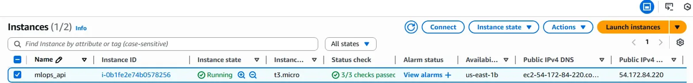
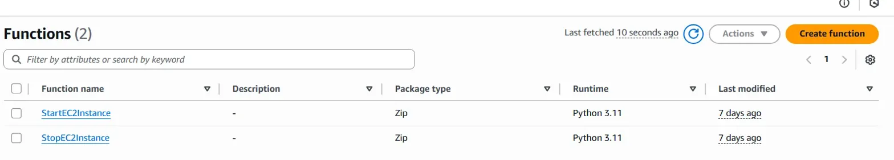
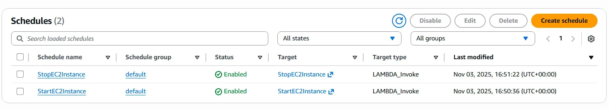
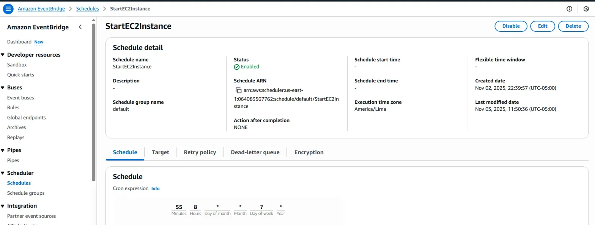
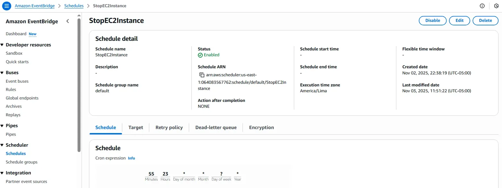

# MLOps Proyecto 3

**Grupo:** Sebastián Rodríguez y David Córdova  
**Curso:** Machine Learning Operations (MLOps)  
**Profesor:** Cristian Diaz Alvarez

Este proyecto implementa un pipeline completo de Machine Learning Operations (MLOps) que automatiza desde la limpieza de datos hasta el entrenamiento de modelos y despliegue de API, utilizando Apache Airflow como orquestador principal, con integración de Grafana, Prometheus y MinIO para monitoreo y almacenamiento de objetos.

---

## 📋 Descripción General

Este proyecto implementa un **pipeline completo de MLOps** que automatiza el proceso de:

1. **Provisión automática de infraestructura AWS** con Lambda Functions y EventBridge
2. **Recolección de datos desde una API Flask** desplegada en EC2 (http://ec2-54-172-84-220.compute-1.amazonaws.com:5001/get_data)
3. **Encendido/apagado programado** de la instancia EC2 (9:00 AM - 11:55 PM) mediante EventBridge Schedules
4. Limpieza, almacenamiento y transformación con **Apache Airflow**
5. **Almacenamiento de datos en MinIO** (S3-compatible object storage)
6. Entrenamiento automático de modelos con **scikit-learn**
7. Registro y seguimiento de experimentos en **MLflow**
8. Despliegue de modelo en una **API FastAPI**
9. **Monitoreo con Grafana y Prometheus** para métricas del sistema
10. Exposición del modelo entrenado como servicio REST para realizar predicciones en tiempo real

---

## 🏗️ Arquitectura AWS

### Componentes de Infraestructura

#### 🖥️ **Instancia EC2**
- **Nombre**: `mlops_api`
- **Instance ID**: `i-0b1fe2e74b0578256`
- **Tipo**: `t3.micro`
- **Sistema Operativo**: Ubuntu
- **IP Pública**: `54.172.84.220`
- **DNS Público**: `ec2-54-172-84-220.compute-1.amazonaws.com`
- **Zona de disponibilidad**: `us-east-1b`
- **Estado**: Running (controlado por Lambda)

#### ⚡ **Lambda Functions**

| Función | Runtime | Propósito | Trigger |
|---------|---------|-----------|---------|
| `StartEC2Instance` | Python 3.11 | Iniciar la instancia EC2 | EventBridge Schedule |
| `StopEC2Instance` | Python 3.11 | Detener la instancia EC2 | EventBridge Schedule |

**Código de las Lambda Functions:**

```python
# start_ec2_instance.py
import boto3

def lambda_handler(event, context):
    ec2 = boto3.client('ec2')
    instance_id = 'i-0b1fe2e74b0578256'
    
    try:
        response = ec2.start_instances(InstanceIds=[instance_id])
        return {
            'statusCode': 200,
            'body': f'Instance {instance_id} started successfully'
        }
    except Exception as e:
        return {
            'statusCode': 500,
            'body': f'Error starting instance: {str(e)}'
        }
```

```python
# stop_ec2_instance.py
import boto3

def lambda_handler(event, context):
    ec2 = boto3.client('ec2')
    instance_id = 'i-0b1fe2e74b0578256'
    
    try:
        response = ec2.stop_instances(InstanceIds=[instance_id])
        return {
            'statusCode': 200,
            'body': f'Instance {instance_id} stopped successfully'
        }
    except Exception as e:
        return {
            'statusCode': 500,
            'body': f'Error stopping instance: {str(e)}'
        }
```

#### 📅 **EventBridge Schedules**

| Schedule | Cron Expression | Target | Status | Hora (Lima) |
|----------|----------------|--------|--------|-------------|
| `StartEC2Instance` | `55 8 * * ? *` | StartEC2Instance Lambda | ✅ Enabled | 9:00 AM |
| `StopEC2Instance` | `55 23 * * ? *` | StopEC2Instance Lambda | ✅ Enabled | 11:55 PM |

**Detalles de configuración:**
- **Schedule ARN**: `arn:aws:scheduler:us-east-1:064083567762:schedule/default/StartEC2Instance`
- **Execution time zone**: America/Lima (UTC-05:00)
- **Schedule group**: default
- **Action after completion**: NONE

---

## 🌐 API de Diabetes en EC2

### Descripción
API Flask que sirve datos de diabetes en bloques de 15,000 registros, con actualización automática cada 5 minutos.

### Estructura en EC2

```
ubuntu@ip-172-31-23-183:~/diabetes_api/
├── Dockerfile
├── app.py
├── data/
│   └── Diabetes/
│       └── Diabetes.csv
├── docker-compose.yml
├── log.txt
├── requirements.txt
├── start_api.sh
└── venv/
```

### Configuración Docker

**Dockerfile:**
```dockerfile
FROM python:3.9-slim

WORKDIR /app

COPY requirements.txt .
RUN pip install --no-cache-dir -r requirements.txt

COPY . .

EXPOSE 5001

CMD ["python", "app.py"]
```

**docker-compose.yml:**
```yaml
version: '3.8'

services:
  diabetes-api:
    build: .
    ports:
      - "5001:5001"
    volumes:
      - ./data:/app/data
      - ./log.txt:/app/log.txt
    restart: unless-stopped
    environment:
      - PYTHONUNBUFFERED=1
```

**start_api.sh:**
```bash
#!/bin/bash
cd /home/ubuntu/diabetes_api
docker-compose up -d
echo "API de Diabetes iniciada en puerto 5001"
docker-compose logs -f
```

### Endpoints de la API

#### `GET /`
Página de bienvenida

**Response:**
```html
<h1>Bienvenido a la API de Diabetes</h1>
<p>Accede a los datos en intervalos de 15,000 filas usando la ruta /get_data</p>
```

#### `GET /get_data`
Obtiene el siguiente bloque de 15,000 registros

**Response:**
```json
[
  {
    "Pregnancies": 6,
    "Glucose": 148,
    "BloodPressure": 72,
    "SkinThickness": 35,
    "Insulin": 0,
    "BMI": 33.6,
    "DiabetesPedigreeFunction": 0.627,
    "Age": 50,
    "Outcome": 1
  },
  ...
]
```

### Funcionamiento Automático

1. **9:00 AM**: EventBridge activa `StartEC2Instance` Lambda
2. Lambda inicia la instancia EC2 `i-0b1fe2e74b0578256`
3. **Auto-inicio del contenedor Docker**: 
   - Configurado con `restart: unless-stopped` en docker-compose
   - El contenedor se inicia automáticamente al encender la EC2
4. **API disponible**: http://ec2-54-172-84-220.compute-1.amazonaws.com:5001/get_data
5. **Actualización de datos**: Cada 5 minutos el scheduler actualiza el bloque disponible
6. **11:55 PM**: EventBridge activa `StopEC2Instance` Lambda
7. Lambda detiene la instancia EC2 para ahorrar costos

---

## ✨ Características Principales

- **Infraestructura AWS automatizada** con Lambda y EventBridge
- **API Flask dockerizada** con auto-inicio en EC2
- **Programación inteligente** de recursos (9 AM - 11:55 PM)
- **Orquestación automática** del pipeline mediante **Airflow**
- **Contenerización total** con **Docker Compose**
- **Auto-disparo del DAG** al iniciar los contenedores
- **Recolección dinámica** de datos desde la API en EC2 (datos nuevos cada 5 min)
- **Almacenamiento en MinIO** para gestión de datos y artefactos
- **Entrenamiento reproducible** y versionado de modelos con MLflow
- **Servicio FastAPI** que permite consumir el modelo para predicciones
- **Monitoreo en tiempo real** con Grafana y Prometheus
- **Volúmenes compartidos** entre servicios para acceso a modelos `.pkl` y configuraciones `.json`

---

## 📁 Estructura del Proyecto

```
Proyecto3_MLOps/
├── dags/
│   ├── __pycache__/
│   ├── scripts/
│   │   ├── funciones.py          # Funciones de procesamiento y entrenamiento
│   │   └── queries.py            # Consultas y operaciones de datos
│   └── orquestador.py            # DAG principal de Airflow
├── fastapi/
│   ├── __pycache__/
│   ├── Dockerfile
│   ├── main.py                   # Aplicación FastAPI para predicciones
│   └── requirements.txt          # Dependencias de FastAPI
├── grafana/
│   └── provisioning/
│       └── datasources/          # Configuración de fuentes de datos
├── locust/
│   └── locustfile.py             # Tests de carga y performance
├── logs/                         # Logs de Airflow
├── minio/                        # Almacenamiento de objetos
├── streamlit/                    # Dashboard interactivo (opcional)
├── images/                       # Screenshots de AWS y servicios
│   ├── ec2_instance.png         # Instancia EC2 running
│   ├── lambda_functions.png     # Lambda functions
│   ├── eventbridge_schedules.png # Schedules configurados
│   ├── schedule_start_detail.png # Detalle StartEC2Instance
│   └── schedule_stop_detail.png  # Detalle StopEC2Instance
├── .env                          # Variables de entorno
├── docker-compose-locust.yaml    # Compose para pruebas de carga
├── docker-compose.yaml           # Compose principal
├── Dockerfile                    # Dockerfile principal
├── Dockerfile_mlflow             # Dockerfile para MLflow
├── prometheus.yml                # Configuración de Prometheus
├── prueba.py                     # Script de pruebas
├── requirements.txt              # Dependencias Python globales
└── requirements_mlflow.txt       # Dependencias específicas de MLflow
```

---

## 🔧 Componentes Principales

### ☁️ AWS Infrastructure

#### Scripts de configuración EC2

```bash
# setup_ec2_scheduler.sh
#!/bin/bash
# Configura las Lambda functions y EventBridge schedules

# add_permissions.sh
#!/bin/bash
# Añade permisos necesarios a las Lambda functions

# update_schedule.sh
#!/bin/bash
# Actualiza la configuración de los schedules
```

#### Políticas IAM

**lambda-trust-policy.json:**
```json
{
  "Version": "2012-10-17",
  "Statement": [
    {
      "Effect": "Allow",
      "Principal": {
        "Service": "lambda.amazonaws.com"
      },
      "Action": "sts:AssumeRole"
    }
  ]
}
```

**ec2-scheduler-policy.json:**
```json
{
  "Version": "2012-10-17",
  "Statement": [
    {
      "Effect": "Allow",
      "Action": [
        "ec2:StartInstances",
        "ec2:StopInstances",
        "ec2:DescribeInstances"
      ],
      "Resource": "*"
    },
    {
      "Effect": "Allow",
      "Action": [
        "logs:CreateLogGroup",
        "logs:CreateLogStream",
        "logs:PutLogEvents"
      ],
      "Resource": "arn:aws:logs:*:*:*"
    }
  ]
}
```

### 🌊 Airflow

- **`dags/orquestador.py`**: DAG principal que orquesta todo el flujo:
  - Verifica que la instancia EC2 esté running
  - Llama a la API Flask en EC2 para recolectar datos (http://ec2-54-172-84-220.compute-1.amazonaws.com:5001/get_data)
  - Procesa y limpia los datos de diabetes
  - Almacena datos en MinIO
  - Entrena el modelo de IA (clasificación de diabetes)
  - Registra el modelo en MLflow
  - Guarda los resultados en volúmenes compartidos
  - Señaliza a FastAPI que el modelo está listo

- **`dags/scripts/funciones.py`**: Contiene las funciones:
  - `check_ec2_status()`: verifica el estado de la instancia EC2
  - `fetch_data_from_api()`: obtiene datos del endpoint de EC2
  - `clean_data()`: preprocesa la información de diabetes
  - `upload_to_minio()`: sube datos a MinIO
  - `train_model()`: entrena modelo de clasificación y guarda + columnas en JSON
  - `register_model_mlflow()`: registra el modelo en MLflow

### 🚀 FastAPI

- **`fastapi/main.py`**:
  - Expone el modelo entrenado como API REST (`/predict`)
  - Recibe JSON con features de diabetes (Glucose, BMI, Age, etc.)
  - Retorna predicción de diabetes (0 o 1)
  - Incluye endpoint de health check (`/health`)
  - Integrado con métricas de Prometheus

**Ejemplo de uso:**
```bash
curl -X POST "http://localhost:8000/predict" \
  -H "Content-Type: application/json" \
  -d '{
    "Pregnancies": 6,
    "Glucose": 148,
    "BloodPressure": 72,
    "SkinThickness": 35,
    "Insulin": 0,
    "BMI": 33.6,
    "DiabetesPedigreeFunction": 0.627,
    "Age": 50
  }'
```

### 📊 MLflow

- **Tracking Server**: Registro de experimentos y métricas
- **Model Registry**: Versionado y gestión de modelos
- **Backend Store**: Base de datos para metadatos
- **Artifact Store**: MinIO para almacenamiento de artefactos

### 🪣 MinIO

- **Object Storage** compatible con S3
- Almacena:
  - Datos crudos y procesados de diabetes
  - Artefactos de modelos (.pkl, .json)
  - Logs y resultados de experimentos
- Accesible vía API y consola web

### 📈 Grafana + Prometheus

- **Prometheus**: Recolección de métricas de:
  - Airflow DAGs
  - FastAPI endpoints
  - Contenedores Docker
  - Sistema operativo
  - EC2 instance status

- **Grafana**: Visualización de:
  - Performance del pipeline
  - Tiempos de entrenamiento
  - Latencia de predicciones
  - Uso de recursos
  - Estado de la instancia EC2

### 🧪 Locust

- **`locust/locustfile.py`**: 
  - Tests de carga para FastAPI
  - Simulación de usuarios concurrentes
  - Medición de latencia y throughput
  - Identificación de cuellos de botella

---

## 🚀 Cómo Ejecutar el Proyecto

### Prerrequisitos

- Docker y Docker Compose instalados
- Al menos 8GB de RAM disponible
- Puertos libres: 8080, 5000, 8000, 3000, 9090, 9000, 9001
- Cuenta AWS con permisos para Lambda, EC2 y EventBridge
- AWS CLI configurado

### Configuración de AWS

#### 1. **Crear las Lambda Functions**

```bash
# Crear rol IAM para Lambda
aws iam create-role \
  --role-name lambda-ec2-scheduler-role \
  --assume-role-policy-document file://lambda-trust-policy.json

# Adjuntar política
aws iam put-role-policy \
  --role-name lambda-ec2-scheduler-role \
  --policy-name EC2SchedulerPolicy \
  --policy-document file://ec2-scheduler-policy.json

# Crear Lambda para iniciar EC2
zip start_ec2_instance.zip start_ec2_instance.py
aws lambda create-function \
  --function-name StartEC2Instance \
  --runtime python3.11 \
  --role arn:aws:iam::064083567762:role/lambda-ec2-scheduler-role \
  --handler start_ec2_instance.lambda_handler \
  --zip-file fileb://start_ec2_instance.zip

# Crear Lambda para detener EC2
zip stop_ec2_instance.zip stop_ec2_instance.py
aws lambda create-function \
  --function-name StopEC2Instance \
  --runtime python3.11 \
  --role arn:aws:iam::064083567762:role/lambda-ec2-scheduler-role \
  --handler stop_ec2_instance.lambda_handler \
  --zip-file fileb://stop_ec2_instance.zip
```

#### 2. **Configurar EventBridge Schedules**

```bash
# Schedule para iniciar EC2 (9:00 AM Lima)
aws scheduler create-schedule \
  --name StartEC2Instance \
  --schedule-expression "cron(55 8 * * ? *)" \
  --schedule-expression-timezone "America/Lima" \
  --flexible-time-window Mode=OFF \
  --target '{
    "Arn": "arn:aws:lambda:us-east-1:064083567762:function:StartEC2Instance",
    "RoleArn": "arn:aws:iam::064083567762:role/EventBridgeSchedulerRole"
  }'

# Schedule para detener EC2 (11:55 PM Lima)
aws scheduler create-schedule \
  --name StopEC2Instance \
  --schedule-expression "cron(55 23 * * ? *)" \
  --schedule-expression-timezone "America/Lima" \
  --flexible-time-window Mode=OFF \
  --target '{
    "Arn": "arn:aws:lambda:us-east-1:064083567762:function:StopEC2Instance",
    "RoleArn": "arn:aws:iam::064083567762:role/EventBridgeSchedulerRole"
  }'
```

#### 3. **Configurar la API en EC2**

```bash
# Conectar a la instancia EC2
ssh -i "tu-key.pem" ubuntu@ec2-54-172-84-220.compute-1.amazonaws.com

# Clonar el repositorio de la API
cd ~
mkdir diabetes_api
cd diabetes_api

# Crear los archivos necesarios
cat > app.py << 'EOF'
[contenido del app.py mostrado anteriormente]
EOF

cat > requirements.txt << 'EOF'
flask==2.3.0
pandas==2.0.0
apscheduler==3.10.0
requests==2.28.0
EOF

cat > Dockerfile << 'EOF'
[contenido del Dockerfile mostrado anteriormente]
EOF

cat > docker-compose.yml << 'EOF'
[contenido del docker-compose.yml mostrado anteriormente]
EOF

# Crear script de inicio
cat > start_api.sh << 'EOF'
[contenido del start_api.sh mostrado anteriormente]
EOF

chmod +x start_api.sh

# Configurar inicio automático
sudo crontab -e
# Añadir: @reboot sleep 60 && /home/ubuntu/diabetes_api/start_api.sh

# Iniciar la API
./start_api.sh
```

### Configuración Local

#### 4. **Clonar el repositorio**
```bash
git clone <repository-url>
cd Proyecto3_MLOps
```

#### 5. **Configurar variables de entorno**
```bash
cp .env.example .env
# Editar .env con tus configuraciones
```

**Ejemplo de .env:**
```env
# API Configuration
API_URL=http://ec2-54-172-84-220.compute-1.amazonaws.com:5001/get_data
EC2_INSTANCE_ID=i-0b1fe2e74b0578256

# Airflow
AIRFLOW_UID=1000
AIRFLOW_GID=0

# MLflow
MLFLOW_TRACKING_URI=http://mlflow:5000

# MinIO
MINIO_ROOT_USER=minioadmin
MINIO_ROOT_PASSWORD=minioadmin123
MINIO_ENDPOINT=minio:9000

# Prometheus
PROMETHEUS_PORT=9090

# Grafana
GRAFANA_ADMIN_USER=admin
GRAFANA_ADMIN_PASSWORD=admin
```

#### 6. **Iniciar todos los servicios**
```bash
docker-compose up -d
```

#### 7. **Verificar que los servicios estén corriendo**
```bash
docker-compose ps
```

#### 8. **Acceder a las interfaces web**:
   - **Airflow**: http://localhost:8080 (user: admin, pass: admin)
   - **MLflow**: http://localhost:5000
   - **FastAPI**: http://localhost:8000/docs
   - **Grafana**: http://localhost:3000 (user: admin, pass: admin)
   - **Prometheus**: http://localhost:9090
   - **MinIO Console**: http://localhost:9001
   - **API Diabetes (EC2)**: http://ec2-54-172-84-220.compute-1.amazonaws.com:5001

#### 9. **Ejecutar pruebas de carga (opcional)**
```bash
docker-compose -f docker-compose-locust.yaml up
```

---

## 📡 Endpoints de la API

### API de Diabetes (EC2)

#### `GET /`
Página de bienvenida

#### `GET /get_data`
Obtiene 15,000 registros de datos de diabetes (se actualiza cada 5 min)

### FastAPI Endpoints (Predicción)

#### `POST /predict`
Realiza predicciones de diabetes con el modelo entrenado.

**Request:**
```json
{
  "Pregnancies": 6,
  "Glucose": 148,
  "BloodPressure": 72,
  "SkinThickness": 35,
  "Insulin": 0,
  "BMI": 33.6,
  "DiabetesPedigreeFunction": 0.627,
  "Age": 50
}
```

**Response:**
```json
{
  "prediction": 1,
  "probability": 0.87,
  "model_version": "v1.0",
  "timestamp": "2025-11-09T10:30:00"
}
```

#### `GET /health`
Verifica el estado del servicio.

**Response:**
```json
{
  "status": "healthy",
  "model_loaded": true,
  "ec2_api_status": "available",
  "version": "1.0.0"
}
```

---

## 📊 Monitoreo y Métricas

### Métricas Disponibles en Prometheus

- `ec2_instance_status`: Estado de la instancia EC2 (1=running, 0=stopped)
- `api_data_fetch_duration_seconds`: Tiempo de obtención de datos desde EC2
- `airflow_dag_run_duration_seconds`: Duración de ejecución del DAG
- `fastapi_requests_total`: Total de requests a FastAPI
- `fastapi_request_duration_seconds`: Latencia de predicciones
- `model_predictions_total`: Total de predicciones realizadas
- `minio_bucket_usage_bytes`: Uso de almacenamiento en MinIO

### Dashboards en Grafana

1. **AWS Infrastructure**: Estado de EC2, Lambda executions, schedules
2. **Pipeline Overview**: Vista general del flujo MLOps
3. **Model Performance**: Métricas del modelo en producción
4. **System Resources**: CPU, memoria, disco
5. **API Performance**: Latencia y throughput de FastAPI

---

## 🔄 Flujo Completo del Pipeline

```
┌─────────────────────────────────────────────────────────────────┐
│                        AWS INFRASTRUCTURE                        │
├─────────────────────────────────────────────────────────────────┤
│                                                                  │
│  ┌──────────────┐    9:00 AM    ┌───────────────────┐          │
│  │ EventBridge  │──────────────>│ StartEC2Instance  │          │
│  │   Schedule   │               │  Lambda Function  │          │
│  └──────────────┘               └──────────┬────────┘          │
│                                             │                    │
│                                             ▼                    │
│  ┌────────────────────────────────────────────────────┐         │
│  │         EC2 Instance (mlops_api)                   │         │
│  │  ┌──────────────────────────────────────────────┐ │         │
│  │  │   Docker Container - Diabetes API (Flask)   │ │         │
│  │  │   Port 5001 - Auto-start on boot            │ │         │
│  │  │   Updates data every 5 minutes              │ │         │
│  │  └──────────────────────────────────────────────┘ │         │
│  └────────────────────────────────────────────────────┘         │
│                            │                                     │
│                            │ 11:55 PM                            │
│                            ▼                                     │
│  ┌──────────────┐    ┌───────────────────┐                     │
│  │ EventBridge  │───>│ StopEC2Instance   │                     │
│  │   Schedule   │    │  Lambda Function  │                     │
│  └──────────────┘    └───────────────────┘                     │
└─────────────────────────────────────────────────────────────────┘
                             │
                             │ HTTP GET /get_data
                             ▼
┌─────────────────────────────────────────────────────────────────┐
│                      LOCAL INFRASTRUCTURE                        │
├─────────────────────────────────────────────────────────────────┤
│                                                                  │
│  ┌───────────────────────────────────────────────────┐          │
│  │              Apache Airflow (Orchestrator)        │          │
│  │  ┌─────────────────────────────────────────────┐ │          │
│  │  │  DAG: orquestador.py                        │ │          │
│  │  │  ├─> Check EC2 Status                       │ │          │
│  │  │  ├─> Fetch Data from API                    │ │          │
│  │  │  ├─> Clean & Transform                      │ │          │
│  │  │  ├─> Upload to MinIO                        │ │          │
│  │  │  ├─> Train Model                            │ │          │
│  │  │  ├─> Register in MLflow                     │ │          │
│  │  │  └─> Signal FastAPI Ready                   │ │          │
│  │  └─────────────────────────────────────────────┘ │          │
│  └──────────────────┬────────────────────────────────┘          │
│                     │                                            │
│                     ├──────────────┬─────────────────┐          │
│                     ▼              ▼                 ▼          │
│  ┌──────────────┐  ┌──────────┐  ┌────────────────────┐        │
│  │    MinIO     │  │  MLflow  │  │  FastAPI Server    │        │
│  │   Storage    │  │ Tracking │  │  ┌──────────────┐  │        │
│  │              │  │          │  │  │ /predict     │  │        │
│  │ - Raw Data   │  │ - Models │  │  │ /health      │  │        │
│  │ - Artifacts  │  │ - Metrics│  │  └──────────────┘  │        │
│  └──────────────┘  └──────────┘  └────────────────────┘        │
│                                             │                    │
│                                             ▼                    │
│  ┌─────────────────────────────────────────────────────┐        │
│  │         Monitoring Stack                            │        │
│  │  ┌──────────────┐    ┌──────────────────────────┐  │        │
│  │  │  Prometheus  │───>│      Grafana             │  │        │
│  │  │  (Metrics)   │    │   (Visualization)        │  │        │
│  │  └──────────────┘    └──────────────────────────┘  │        │
│  └─────────────────────────────────────────────────────┘        │
│                                                                  │
└─────────────────────────────────────────────────────────────────┘
```

---

## 📸 Screenshots

### AWS Infrastructure


*Instancia EC2 ejecutándose con la API de Diabetes*


*Lambda Functions para control de EC2*


*Schedules configurados para encendido/apagado automático*


*Detalle del schedule StartEC2Instance (9:00 AM)*


*Detalle del schedule StopEC2Instance (11:55 PM)*

---

## 🐛 Troubleshooting

### La instancia EC2 no se inicia automáticamente
```bash
# Verificar los logs de la Lambda
aws logs tail /aws/lambda/StartEC2Instance --follow

# Verificar el schedule
aws scheduler get-schedule --name StartEC2Instance

# Invocar manualmente la Lambda
aws lambda invoke
